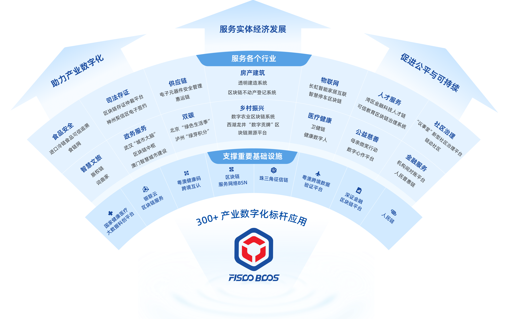

中文 / [English](docs/README_EN.md)

FISCO BCOS（读作/ˈfɪskl  bi:ˈkɒz/）是由微众牵头的金链盟主导研发、对外开源、安全可控的企业级金融区块链底层技术平台。
单链配置下，性能TPS可达10万+。提供群组架构、并行计算、分布式存储、可插拔的共识机制、隐私保护算法、支持全链路国密算法等诸多特性。
FISCO BCOS是一个稳定、高效、安全的区块链底层平台，其可用性经广泛应用实践检验。至今已超过4000家企业及机构、300+产业数字化标杆应用，覆盖文化版权、司法服务、政务服务、物联网、金融、智慧社区、房产建筑、社区治理、乡村振兴等领域。

**架构**

Air 、Pro、Max：可部署为三种架构形态

- **轻便Air版**：拥有与 v2.0版本相同的形态，所有功能在一个区块链节点中（all-in-one）。该架构简单，可快速部署在任意环境中。你可以用它进行区块链入门、开发、测试、POC验证等工作。
- **专业Pro版**：该架构通过将区块链节点的接入层模块独立为进程，在实现接入层与核心模块分区部署的同时，让区块链核心功模块以多群组方式扩展。该架构实现了分区隔离，可应对将来可能的业务拓展，适合有持续业务扩展的生产环境。
- **大容量Max版**：该架构在Pro版的基础上提供链的核心模块主备切换的能力，并可通过多机部署交易执行器和接入分布式存储TiKV，实现计算与存储的平行拓展。该架构中的一个节点由一系列微服务组成，但它依赖较高的运维能力，适合需要海量计算和存储的场景。

**功能**

- 区块链文件系统：所见即所得的合约数据管理
- SDK基础库：更方便的全平台国密接入
- 交易并行冲突分析工具：自动生成交易冲突变量
- WBC-Liquid：用Rust写合约
- 权限治理框架：多方投票治理区块链

**特性**

- Pipeline：区块流水线，连续且紧凑地生成区块
- DMC：实现交易处理性能的多机拓展
- PBFT共识算法：立即一致的共识算法，实现交易秒级确认
- +TiKV：分布式事务性提交，支撑海量存储

**继承与升级**

- Solidity：支持至0.8.11版本
- CRUD：采用表结构存储数据，本版本中封装了更易用的接口，对业务开发更友好
- AMOP：链上信使协议，借助区块链的P2P网络实现信息传输，实现接入区块链的应用间数据通信
- 落盘加密：区块链节点的私钥和数据加密存储于物理硬盘中，物理硬件丢失也无法解密
- 密码算法：内置群环签名等密码算法，可支持各种安全多方计算场景
- 区块链监控：实现区块链状态的实时监控与数据上报

## 技术文档
FISCO BCOS官方技术文档提供建链开发指引、工具介绍以及设计原理解析，用户可通过阅读官方技术文档快速了解FISCO BCOS。
1. [快速开始](https://fisco-bcos-doc.readthedocs.io/zh_CN/latest/docs/quick_start/hardware_requirements.html)
2. [合约开发](https://fisco-bcos-doc.readthedocs.io/zh_CN/latest/docs/contract_develop/solidity_develop.html)
3. [SDK教程](https://fisco-bcos-doc.readthedocs.io/zh_CN/latest/docs/sdk/index.html)
4. [搭链教程](https://fisco-bcos-doc.readthedocs.io/zh_CN/latest/docs/tutorial/air/index.html)
5. [应用开发](https://fisco-bcos-doc.readthedocs.io/zh_CN/latest/docs/develop/index.html)
6. [区块链运维工具](https://fisco-bcos-doc.readthedocs.io/zh_CN/latest/docs/operation_and_maintenance/build_chain.html)
7. [高阶功能使用](https://fisco-bcos-doc.readthedocs.io/zh_CN/latest/docs/advanced_function/safety.html)
8. [设计原理](https://fisco-bcos-doc.readthedocs.io/zh_CN/latest/docs/design/architecture.html)

- **[FISCO BCOS 3.x技术文档](https://fisco-bcos-doc.readthedocs.io/zh_CN/latest/)**
- **[FISCO BCOS 2.x 技术文档（stable）](https://fisco-bcos-documentation.readthedocs.io/zh_CN/latest/)**

## 落地应用案例

FISCO BCOS已落地300+产业数字化标杆应用，场景覆盖文化版权、司法服务、政务服务、物联网、金融、智慧社区、房产建筑、社区治理、乡村振兴等领域，以下部分列举FISOC BCOS在各个领域落地的标杆应用：

- **基础设施：**
  - 区块链服务网络 BSN
  - 珠三角征信链 
  - 粤澳健康码跨境互认系统 
  - 粤澳跨境数据验证平台
  - 银联云区块链服务 
  - 深证金融区块链平台
  - 国家健康医疗大数据科技创新应用平台
- **智慧政务：**
  - 武汉"城市大脑"区块链中枢
  - 郑州：公积金区块链日志平台
  - 澳门智慧城市建设之证书电子化项目
  - 南京发改委：基于区块链的项目评审与专家管理系统
- **双碳应用：**
  - 碳低链
  - 北京：绿色生活碳普惠平台“绿色生活季”
  - 北京：全国首例区块链 + 绿色出行项目
  - 泸州：“绿芽积分”号召全民绿色减碳
- **乡村振兴：**
  - 西湖龙井：“数字贡牌”区块链溯源平台
  - 福建三明某县农业农村局：茶叶认标购茶区块链溯源平台
  - 海南冷泉阉鸡农业合作社：智慧农业养殖大数据云平台
  - 内蒙古科左中旗：国家现代农业产业园大数据平台建设
  - “蜜链盟”乡村振兴基层治理数字化平台
- **医疗健康：**
  - 卫健链
  - 厦门市医疗保障局：医保基金稽查案件管理系统
  - 西安市莲湖区医疗保障局：医保定点医药机构精细化管理服务平台
  - 健康数字人、医疗大数据科研云平台项目
  - 基于区块链的分布式电子病历交互与共享平台
- **公益慈善：**
  - 99 公益日
  - "数字心作”平台
  - 人民链数字福虎
  - 第一反应互助急救链
  - 长安大学城梦想小镇居民公益积分项目
- **金融服务：**
  - 人民普惠链
  - 机构间对账平台
  - 中国银联区块链可信存证服务
  - “吉惠通”一站式金融综合服务平台
  - 永安市小微金融全流程数字服务平台
  - 基于区块链的区域股权金融综合服务平台
- **智慧文旅：**
  - 版权链
  - 词曲家
  - 虎彩印刷链
  - 人民版权平台
  - 城市级区块链文旅运营平台
  - 南方航空：区块链数字资产管理平台
- **司法存证：** 
  - 区块链存证仲裁平台
  - 智慧审判留痕系统
  - 枢纽链：区块链司法存证平台
  - 优证云：基于 FISCO BCOS 的存证平台
  - 神州契信区块链电子签约系统
- **社区治理：**
  - 腾讯未来社区：区块链业主决策系统
  - 海口市琼山区：基于区块链的新型社区治理平台“议事堂” 
  - 济南市中区交警大队：基于区块链的共享单车管理系统
  - 链动社区：基于 FISCO BCOS 的智慧社区数字化治理平台等
- **物联网：**
  - 惠运链 - 物流保险区块链平台
  - 电子元器件供应链安全管理平台
  - 广汽本田区块链合同供应链管理系统
  - 基于区块链的数字化供应链管理系统平台
- **房产建筑：**
  - 透明建造系统
  - 透明劳务平台
  - 基于 BIM 区块链的施工过程结算解决方案

FISCO BCOS生态的产业应用案例中发现很多足以影响未来的标杆应用示范，涵盖16类场景的169个典型应用案例，具体可参考[2022 FISCO BCOS产业白皮书](https://mp.weixin.qq.com/s/hERIQbnkd_-uAMVRx7Q6WQ)。

## 贡献代码

- 我们欢迎并非常感谢您的贡献，请参阅[代码贡献流程](https://fisco-bcos-doc.readthedocs.io/zh_CN/latest/docs/community/pr.html#)。

- 如项目对您有帮助，欢迎star支持！

## 加入我们的社区

**FISCO BCOS开源社区**是国内庞大且活跃的开源社区，开源以来，围绕FISCO BCOS所构建的开源社区已汇集超4000家企业及机构、9万余名个人成员共建共治共享，成功支持政务、金融、农业、公益、文娱、供应链、物联网等重点应用领域的数百个区块链应用场景落地，收集到的标杆应用超过300个，构建出庞大且活跃的开源联盟链生态圈。

如您对FISCO BCOS开源技术及应用感兴趣，欢迎加入社区获得更多支持与帮助。
- [2022年度MVP](https://fisco-bcos-doc.readthedocs.io/zh_CN/latest/docs/community/MVP_list_new.html)
- [2022年度贡献者](https://fisco-bcos-doc.readthedocs.io/zh_CN/latest/docs/community/contributor_list_new.html)
- [2022新增合作伙伴](https://mp.weixin.qq.com/s/ES8ZpkfywKELv0DZZrG6eQ)
- [2022 FISCO BCOS产业应用白皮书](https://mp.weixin.qq.com/s/hERIQbnkd_-uAMVRx7Q6WQ)
- [数实相生 链筑未来 | FISCO BCOS开源五周年](https://mp.weixin.qq.com/s/LjkpIucm6gfSp-UdEJW1mw)
- [社区历史文章资源](https://fisco-bcos-doc.readthedocs.io/zh_CN/latest/docs/articles/index.html)

## License

FISCO BCOS的开源协议为Apache License 2.0, 详情参见[LICENSE](LICENSE)。
