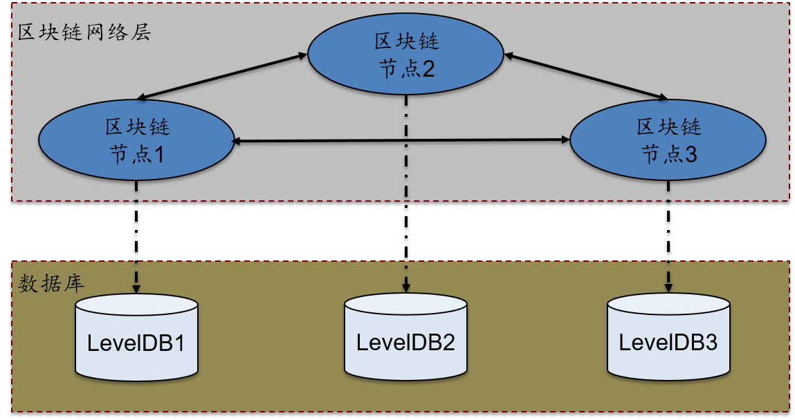
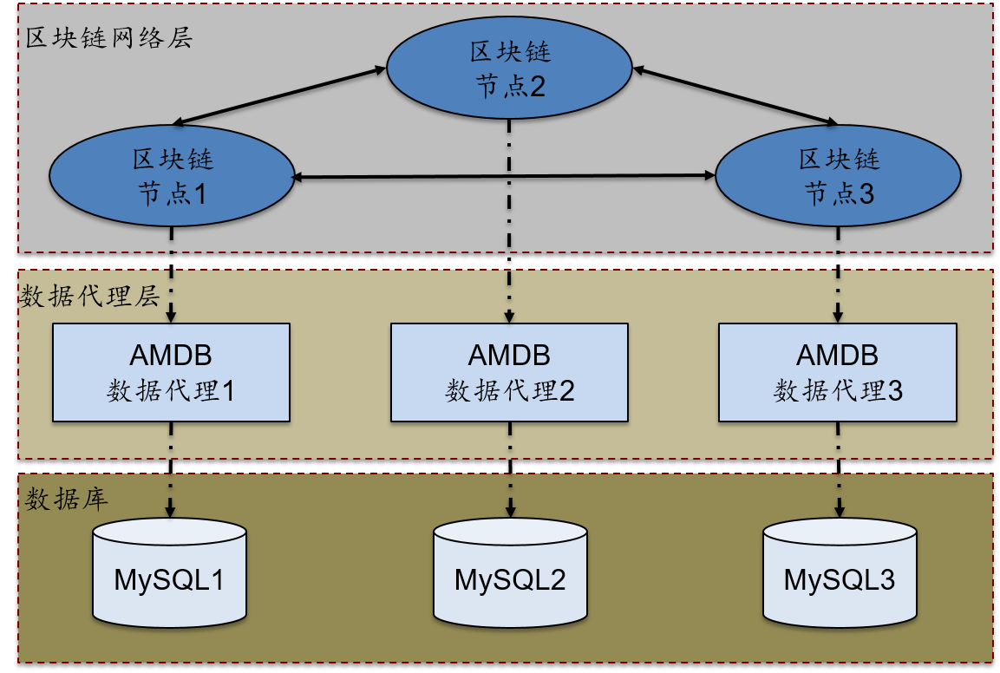

# AMDB使用指南

**使用说明：** 
使用本文档之前，需要先利用 FISCO-BCOS1.5 搭建一条区块链([FISCO BCOS使用说明书](https://github.com/FISCO-BCOS/FISCO-BCOS/blob/dev-1.5/doc/manual))。

## AMDB 介绍
AMDB(Advanced Mass Database, 分布式存储)为联盟链的智能合约提供高性能、可无限扩展容量的存储服务，其特性如下:

* 高性能：支持数据批量读取、写入。
* 可定制：支持后端接入 MySQL、Oracle 等关系型数据库，也可根据通信协议，定制数据库代理服务。
* 可扩展：支持以分库分表的形式扩展数据库容量，实际数据存储量无上限。
* 易使用：提供类似 SQL 的条件查询能力。

AMDB 支持两种状态数据库配置，即 leveldb 和 amop 配置模式。

## **1 leveldb 配置模式**

leveldb 配置模式是节点配置的默认方式，节点可以直接访问 leveldb 分布式存储服务，其逻辑架构图如下：



### **1.1 节点配置**
FISCO-BCOS1.5 版本中的节点配置文件为 config.conf，其中 [statedb] 部分为 AMDB 的状态数据库配置。将 type 配置为 leveldb (默认配置)，可以连接 leveldb 数据库，具体配置如下:
```ini
[statedb] 
        ; statedb的类型默认为leveldb
        type=leveldb
        ; leveldb存储数据的路径
        path=data/statedb
```
> **注意：** 
节点的配置文件是ini格式，如果有注释，注释（以分号开始）需要单独一行，不能放在配置项同一行，否则节点无法启动。

### **1.2 节点的监听端口配置**
节点配置文件 [rpc] 部分的 listen_port 是 AMDB 配置文件中使用的区块链节点的监听端口。
```ini
[rpc]
    listen_ip=127.0.0.1
    listen_port=30301
    http_listen_port=30302
    console_port=30303
```
> **注意：** 
节点配置文件配置为 leveldb 方式，FISCO BCOS 的分布式存储配置已完成。不需要使用 AMDB 数据代理服务，区块链相关数据将会存储在内置的 leveldb 数据库中。

## **2 amop 配置模式**

选择 amop 配置方式，需要配置 AMDB 数据代理服务，节点通过 AMDB 数据代理访问 MySQL 数据库，当配置为其他数据库，如 Oracle 也类似访问。其逻辑架构图如下：



### **2.1 节点配置**
将 type 配置为 amop，可以连接 mysql 数据库。其中 topic 配置与 AMDB 的配置文件相一致，具体配置如下：
```ini
[statedb]
        ; statedb的类型配置为amop
        type=amop 
        ; amop关注的topic默认为DB
        topic=DB 
        ; 可选项，最大重连次数，默认配置为0，表示不限次数重连
        ; maxRetry=0
```

### **2.2 节点的监听端口配置**
节点配置文件 [rpc] 部分的 listen_port 是 AMDB 配置文件中使用的区块链节点的监听端口。
```ini
[rpc]
    listen_ip=127.0.0.1
    listen_port=30301
    http_listen_port=30302
    console_port=30303
```
### **2.3 gradle 环境部署**

此处给出简单步骤，供快速查阅。更详细的步骤，请参考[官网](http://www.gradle.org/downloads)。

从官网下载对应版本的 gradle 安装包，并解压到相应目录。

```shell
mkdir /software/
unzip -d /software/ gradleXXX.zip
```

配置环境变量

```shell
export GRADLE_HOME=/software/gradle-2.14
export PATH=$GRADLE_HOME/bin:$PATH
```

### **2.4 MySQL 数据库配置**
节点配置为 amop 方式时，需要安装 MySQL 数据库，在 Ubuntu 和 CentOS 服务器上的配置方式如下。

Ubuntu：执行下面三条命令，安装过程中，配置 root 账户密码。
```bash
sudo apt-get install mysql-server
sudo apt install mysql-client
sudo apt install libmysqlclient-dev
```
启动 MySQL 服务并登陆:
```bash
sudo service msyql start
mysql -uroot -p
```
CentOS: 执行下面两条命令进行安装。
```bash
yum install mysql*
#某些版本的linux，需要安装mariadb，mariadb是mysql的一个分支
yum install mariadb*
```
启动 MySQL 服务，登陆并为 root 用户设置密码。
```shell
service mysqld start
#若安装了mariadb，则使用下面的命令启动
service mariadb start
mysql -uroot
mysql> set password for root@localhost = password('123456');
```

## **3 AMDB 数据代理配置**
AMDB 数据代理与区块链节点交互，使用 JSON 数据格式发送和接收请求。

### **3.1 源码下载与编译**
源码地址：
```bash
https://github.com/FISCO-BCOS/AMDB.git
```
下载后，进入 AMDB 根目录，切换到 dev 分支并编译：
```bash
cd AMDB
git checkout dev
gradle build
```
编译成功后根目录下会生成 dist目录，dist 目录结构为如下：
```bash
├── apps
│   └── AMDB.jar
├── conf
│   ├── amdb.properties
│   ├── applicationContext.xml
│   ├── contracts
│   │   └── DB.sol
│   ├── db.properties
│   ├── doc
│   │   ├── amop.png
│   │   ├── leveldb.png
│   │   └── README.md
│   ├── log4j2.xml
│   └── mappers
│       └── data_mapper.xml
├── lib
├── log
└── start.sh
```

### **3.2 配置节点证书**
《FISCO BCOS区块链操作手册》3.3 节中会生成 sdk 证书目录，将 sdk 目录下所有文件（包括 ca.crt 和 client.keystore）拷贝到 dist/conf 目录下。
* ca.crt: 链证书
* client.keystore：web3sdk 的 SSL 证书

### **3.3 配置文件设置**
AMDB 的 dist/conf 目录下有配置文件 amdb.properties 和 db.properties。 amdb.properties 配置 AMDB 数据代理需要连接的节点配置信息，其配置信息与节点配置文件 config.json 保持一致，具体配置内容如下：
```properties
# 节点ip
node.ip=127.0.0.1
# 节点的rpc listen_port
node.listen_port=30301
# 节点的topic
node.topic=DB
# 节点的keystore密码
keystorePassWord=123456
# 节点的clientCert密码
clientCertPassWord=123456
```

db.properties 为连接数据库的配置文件，具体配置内容如下:
```properties
# 数据库服务所在的ip
db.ip=127.0.0.1
# 数据库的监听端口
db.port=3306
# 数据库用户名
db.user=root
# 数据库密码
db.password=123456
# 数据库名
db.database=bcos
```
> **注意：**
**每个节点必须配置一个 AMDB 数据代理服务，并且不能共用，数据库可以共用。**


## **4 启动 AMDB 数据代理服务**
首先确保 AMDB 配置的区块链节点正常启动，MySQL 数据库服务正常启动，配置的数据库已建立。AMDB 数据代理配置完毕后，在 dist 目录下，运行启动脚本即可启动 AMDB 数据代理服务：
```bash
bash ./start.sh
```
AMDB 数据代理启动之后，会在配置的数据库中创建系统表_sys_tables_ 和_sys_miners_，其中_sys_tables_表保存所有的建表字段信息，用于创建其他表；_sys_miners_表用于保存共识节点的信息。

## **5 AMDB使用**

### **5.1 智能合约开发**
访问 AMDB 需要使用 AMDB 专用的智能合约 DB.sol 接口，该接口是数据库合约，可以创建表，并对表进行增删改查操作。

DB.sol文件代码如下:
```js

contract DBFactory {
    function openDB(string) public constant returns (DB);
    function createTable(string,string,string) public constant returns(DB);
}

//查询条件
contract Condition {
    function EQ(string, int);
    function EQ(string, string);
    
    function NE(string, int);
    function NE(string, string);

    function GT(string, int);
    function GE(string, int);
    
    function LT(string, int);
    function LE(string, int);
    
    function limit(int);
    function limit(int, int);
}

//单条数据记录
contract Entry {
    function getInt(string) public constant returns(int);
    function getAddress(string) public constant returns(address);
    function getBytes64(string) public constant returns(byte[64]);
    function getBytes32(string) public constant returns(bytes32);
    
    function set(string, int) public;
    function set(string, string) public;
}

//数据记录集
contract Entries {
    function get(int) public constant returns(Entry);
    function size() public constant returns(int);
}

//DB主类
contract DB {
    //查询接口
    function select(string, Condition) public constant returns(Entries);
    //插入接口
    function insert(string, Entry) public returns(int);
    //更新接口
    function update(string, Entry, Condition) public returns(int);
    //删除接口
    function remove(string, Condition) public returns(int);
    
    function newEntry() public constant returns(Entry);
    function newCondition() public constant returns(Condition);
}
```
提供一个合约案例 DBTest.sol，代码如下：
``` js
import "DB.sol";

contract DBTest {
    event selectResult(bytes32 name, int item_id, bytes32 item_name);
    event insertResult(int count);
    event updateResult(int count);
    event removeResult(int count);
    
    //创建表
    function create() public {
        DBFactory df = DBFactory(0x1001);
        df.createTable("t_test", "name", "item_id,item_name");
    }

    //查询数据
    function select(string name) public constant returns(bytes32[], int[], bytes32[]){
        DBFactory df = DBFactory(0x1001);
        DB db = df.openDB("t_test");
        
        Condition condition = db.newCondition();
        //condition.EQ("name", name);
        
        Entries entries = db.select(name, condition);
        bytes32[] memory user_name_bytes_list = new bytes32[](uint256(entries.size()));
        int[] memory item_id_list = new int[](uint256(entries.size()));
        bytes32[] memory item_name_bytes_list = new bytes32[](uint256(entries.size()));
        
        for(int i=0; i<entries.size(); ++i) {
            Entry entry = entries.get(i);
            
            user_name_bytes_list[uint256(i)] = entry.getBytes32("name");
            item_id_list[uint256(i)] = entry.getInt("item_id");
            item_name_bytes_list[uint256(i)] = entry.getBytes32("item_name");
        }
        selectResult(user_name_bytes_list, item_id_list, item_name_bytes_list);
        
        return (user_name_bytes_list, item_id_list, item_name_bytes_list);
    }
    //插入数据
    function insert(string name, int item_id, string item_name) public returns(int) {
        DBFactory df = DBFactory(0x1001);
        DB db = df.openDB("t_test");
        
        Entry entry = db.newEntry();
        entry.set("name", name);
        entry.set("item_id", item_id);
        entry.set("item_name", item_name);
        
        int count = db.insert(name, entry);
        insertResult(count);
        
        return count;
    }
    //更新数据
    function update(string name, int item_id, string item_name) public returns(int) {
        DBFactory df = DBFactory(0x1001);
        DB db = df.openDB("t_test");
        
        Entry entry = db.newEntry();
        entry.set("item_name", item_name);
        
        Condition condition = db.newCondition();
        condition.EQ("name", name);
        condition.EQ("item_id", item_id);
        
        int count = db.update(name, entry, condition);
        updateResult(count);
        
        return count;
    }
    //删除数据
    function remove(string name, int item_id) public returns(int){
        DBFactory df = DBFactory(0x1001);
        DB db = df.openDB("t_test");
        
        Condition condition = db.newCondition();
        condition.EQ("name", name);
        condition.EQ("item_id", item_id);
        
        int count = db.remove(name, condition);
        removeResult(count);
        
        return count;
    }
}
```
DBTest.sol 调用了 AMDB 专用的智能合约 DB.sol，实现的是创建用户表 t_test，并对 t_test 表进行增删改查的功能。当交易执行过程中出现异常情况，包括 gas 不足、抛出异常等，目前通过分布式存储操作已写入的数据不会回滚。

> **注意：** 
客户端需要调用转换为 Java 文件的合约代码，需要将 DBTest.sol 和 DB.sol 放入 web3sdk 的 contract 目录下，通过 web3sdk 的编译脚本生成 DBTest.java。web3sdk 的配置和使用请参考[ web3sdk使用指南](https://github.com/FISCO-BCOS/web3sdk/tree/web3sdk-doc)。


### **5.2 客户端调用**
客户端通过 web3sdk 调用智能合约向区块链节点发请求 (web3sdk 的使用请参考 [web3sdk使用指南](https://github.com/FISCO-BCOS/web3sdk/tree/web3sdk-doc)) 便可以通过 AMDB 访问分布式存储服务。