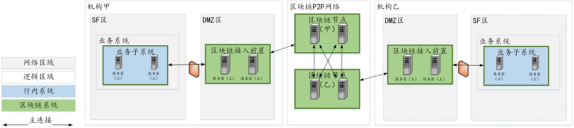

# AMOP使用指南

## 介绍
AMOP（链上链下）系统旨在为联盟链提供一个安全高效的消息信道，联盟链中的各个机构，只要部署了区块链节点，无论是共识节点还是观察节点，均可使用AMOP进行通讯，AMOP有如下优势：
- 实时：AMOP消息不依赖区块链交易和共识，消息在节点间实时传输，延时在毫秒级
- 可靠：AMOP消息传输时，自动寻找区块链网络中所有可行的链路进行通讯，只要收发双方至少有一个链路可用，消息就保证可达
- 高效：AMOP消息结构简洁、处理逻辑高效，仅需少量cpu占用就足以跑满网络带宽
- 安全：AMOP的所有通讯链路使用SSL加密，加密算法可配置
- 易用：使用AMOP时，无需在SDK做任何额外配置

## 逻辑架构


各区域概述：
- SF区：机构内部的业务服务区，此区域内的业务子系统使用区块链SDK，如无DMZ区，配置SDK连接到区块链节点，反之配置SDK连接到DMZ区的区块链前置
- DMZ区：机构内部的外网隔离区，非必须，如有，该区域部署区块链前置
- 区块链P2P网络：此区域部署各机构的区块链节点，此区域为逻辑区域，区块链节点也可部署在机构内部

## 配置
AMOP无需任何额外配置，以下为SDK的配置案例
SDK配置（Spring Bean）：
```

	<?xml version="1.0" encoding="UTF-8" ?>
	<beans xmlns="http://www.springframework.org/schema/beans"
		xmlns:xsi="http://www.w3.org/2001/XMLSchema-instance" xmlns:p="http://www.springframework.org/schema/p"
		xmlns:tx="http://www.springframework.org/schema/tx" xmlns:aop="http://www.springframework.org/schema/aop"
		xmlns:context="http://www.springframework.org/schema/context"
		xsi:schemaLocation="http://www.springframework.org/schema/beans   
	    http://www.springframework.org/schema/beans/spring-beans-2.5.xsd  
	         http://www.springframework.org/schema/tx   
	    http://www.springframework.org/schema/tx/spring-tx-2.5.xsd  
	         http://www.springframework.org/schema/aop   
	    http://www.springframework.org/schema/aop/spring-aop-2.5.xsd">
	    
	<!-- AMOP消息处理线程池配置，根据实际需要配置 -->
	<bean id="pool" class="org.springframework.scheduling.concurrent.ThreadPoolTaskExecutor">
		<property name="corePoolSize" value="50" />
		<property name="maxPoolSize" value="100" />
		<property name="queueCapacity" value="500" />
		<property name="keepAliveSeconds" value="60" />
		<property name="rejectedExecutionHandler">
			<bean class="java.util.concurrent.ThreadPoolExecutor.AbortPolicy" />
		</property>
	</bean>
	
	<!-- 区块链节点信息配置 -->
	<bean id="channelService" class="org.bcos.channel.client.Service">
		<property name="orgID" value="WB" /> <!-- 配置本机构名称 -->
			<property name="allChannelConnections">
				<map>
					<entry key="WB"> <!-- 配置本机构的区块链节点列表（如有DMZ，则为区块链前置）-->
						<bean class="org.bcos.channel.handler.ChannelConnections">
							<property name="connectionsStr">
								<list>
									<value>NodeA@127.0.0.1:30333</value><!-- 格式：节点名@IP地址:端口，节点名可以为任意名称 -->
								</list>
							</property>
						</bean>
					</entry>
				</map>
			</property>
		</bean>
	</bean>
```

区块链前置配置，如有DMZ区：
```

	<?xml version="1.0" encoding="UTF-8" ?>
	<beans xmlns="http://www.springframework.org/schema/beans"
		xmlns:xsi="http://www.w3.org/2001/XMLSchema-instance" xmlns:p="http://www.springframework.org/schema/p"
		xmlns:tx="http://www.springframework.org/schema/tx" xmlns:aop="http://www.springframework.org/schema/aop"
		xmlns:context="http://www.springframework.org/schema/context"
		xsi:schemaLocation="http://www.springframework.org/schema/beans   
	    http://www.springframework.org/schema/beans/spring-beans-2.5.xsd  
	         http://www.springframework.org/schema/tx   
	    http://www.springframework.org/schema/tx/spring-tx-2.5.xsd  
	         http://www.springframework.org/schema/aop   
	    http://www.springframework.org/schema/aop/spring-aop-2.5.xsd">
	    
	    <!-- 区块链节点信息配置 -->
		<bean id="proxyServer" class="org.bcos.channel.proxy.Server">
			<property name="remoteConnections">
				<bean class="org.bcos.channel.handler.ChannelConnections">
					<property name="connectionsStr">
						<list>
							<value>NodeA@127.0.0.1:5051</value><!-- 格式：节点名@IP地址:端口，节点名可以为任意名称 -->
						</list>
					</property>
				</bean>
			</property>
			
			<property name="localConnections">
				<bean class="org.bcos.channel.handler.ChannelConnections">
				</bean>
			</property>
			<!-- 区块链前置监听端口配置，区块链SDK连接用 -->
			<property name="bindPort" value="30333"/>
		</bean>
	</beans>
```

## SDK使用
AMOP的消息收发基于topic（主题）机制，服务端首先设置一个topic，客户端往该topic发送消息，服务端即可收到。

AMOP支持在同一个区块链网络中有多个topic收发消息，topic支持任意数量的服务端和客户端，当有多个服务端关注同一个topic时，该topic的消息将随机下发到其中一个可用的服务端。

服务端代码案例：

```

	package org.bcos.channel.test;
	
	import java.util.ArrayList;
	import java.util.List;
	
	import org.slf4j.Logger;
	import org.slf4j.LoggerFactory;
	import org.springframework.context.ApplicationContext;
	import org.springframework.context.support.ClassPathXmlApplicationContext;
	
	import org.bcos.channel.client.Service;
	
	public class Channel2Server {
		static Logger logger = LoggerFactory.getLogger(Channel2Server.class);
		
		public static void main(String[] args) throws Exception {
			if(args.length < 1) {
				System.out.println("参数: 接收topic");
				return;
			}
			
			String topic = args[0];
	
			ApplicationContext context = new ClassPathXmlApplicationContext("classpath:applicationContext.xml");
			Service service = context.getBean(Service.class);
			
			//设置topic，支持多个topic
			List<String> topics = new ArrayList<String>();
			topics.add(topic);
			service.setTopics(topics);
			
			//处理消息的PushCallback类，参见Callback代码
			PushCallback cb = new PushCallback();
			service.setPushCallback(cb);
			
			//启动服务
			service.run();
		}
	}
```
服务端的PushCallback类案例：

```

	package org.bcos.channel.test;
	
	import java.time.LocalDateTime;
	import java.time.format.DateTimeFormatter;
	
	import org.slf4j.Logger;
	import org.slf4j.LoggerFactory;
	
	import org.bcos.channel.client.ChannelPushCallback;
	import org.bcos.channel.dto.ChannelPush;
	import org.bcos.channel.dto.ChannelResponse;
	
	class PushCallback extends ChannelPushCallback {
		static Logger logger = LoggerFactory.getLogger(PushCallback2.class);
		
		//onPush方法，在收到AMOP消息时被调用
		@Override
		public void onPush(ChannelPush push) {
			DateTimeFormatter df = DateTimeFormatter.ofPattern("yyyy-MM-dd HH:mm:ss");
			logger.debug("收到PUSH消息:" + push.getContent());
			
			System.out.println(df.format(LocalDateTime.now()) + "server:收到PUSH消息:" + push.getContent());
			
			//回包消息
			ChannelResponse response = new ChannelResponse();
			response.setContent("receive request seq:" + String.valueOf(push.getMessageID()));
			response.setErrorCode(0);
			
			push.sendResponse(response);
		}
	}
```

客户端案例：
```

	package org.bcos.channel.test;
	
	import java.time.LocalDateTime;
	import java.time.format.DateTimeFormatter;
	import java.util.Date;
	import java.util.Random;
	
	import org.slf4j.Logger;
	import org.slf4j.LoggerFactory;
	import org.springframework.context.ApplicationContext;
	import org.springframework.context.support.ClassPathXmlApplicationContext;
	
	import org.bcos.channel.client.Service;
	import org.bcos.channel.dto.ChannelRequest;
	import org.bcos.channel.dto.ChannelResponse;
	
	public class Channel2Client {
		static Logger logger = LoggerFactory.getLogger(Channel2Client.class);
		
		public static void main(String[] args) throws Exception {
			if(args.length < 1) {
				System.out.println("参数: 目标topic");
				return;
			}
			
			String topic = args[0];
			
			DateTimeFormatter df = DateTimeFormatter.ofPattern("yyyy-MM-dd HH:mm:ss");
	
			ApplicationContext context = new ClassPathXmlApplicationContext("classpath:applicationContext.xml");
	
			Service service = context.getBean(Service.class);
			service.run();
			
			Thread.sleep(2000); //建立连接需要一点时间，如果立即发送消息会失败
	
			ChannelRequest request = new ChannelRequest();
			request.setToTopic(topic); //设置消息topic
			request.setMessageID(service.newSeq()); //消息序列号，唯一标识某条消息，可用newSeq()随机生成
			request.setTimeout(5000); //消息的超时时间
				
			request.setContent("request seq:" + request.getMessageID()); //发送的消息内容
				
			ChannelResponse response = service.sendChannelMessage2(request); //发送消息
				
			System.out.println(df.format(LocalDateTime.now()) + "收到回包 seq:" + String.valueOf(response.getMessageID()) + ", 错误码:" + response.getErrorCode() + ", 内容:" + response.getContent());
		}
	}
```


## 错误码

- 99：发送消息失败，AMOP经由所有链路的尝试后，消息未能发到服务端，建议使用发送时生成的seq，检查链路上各个节点的处理情况
- 102：消息超时，建议检查服务端是否正确处理了消息，带宽是否足够

