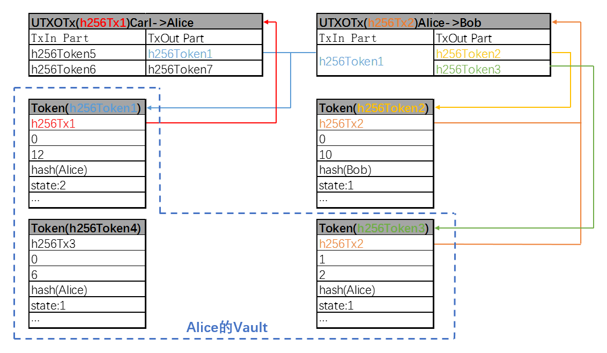

# 以太坊上基于UTXO模型的转账交易方案——使用手册

  

## 目录
<!-- TOC -->

- [1 基本介绍](#1-基本介绍)
    - [1.1 方案背景](#11-方案背景)
        - [1.1.1 原有以太坊转账方案的不足之处](#111-原有以太坊转账方案的不足之处)
        - [1.1.2 本方案解决上述问题的思路](#112-本方案解决上述问题的思路)
    - [1.2 交易原则](#12-交易原则)
    - [1.3 数据类型](#13-数据类型)
- [2 使用说明](#2-使用说明)
    - [2.0 前期准备：启用UTXO交易](#20-前期准备：启用UTXO交易)
    - [2.1 资产登记交易及转账交易](#21-资产登记交易及转账交易)
        - [2.1.1 资产登记交易及转账交易相关的命令](#211-资产登记交易及转账交易相关的命令)
        - [2.1.2 交易命令相关字段说明](#212-交易命令相关字段说明)
        - [2.1.3 基础交易例子](#213-基础交易例子)
        - [2.1.4 可扩展转账限制逻辑例子一：限制Token的使用账号为特定账号](#214-可扩展转账限制逻辑例子一：限制Token的使用账号为特定账号)
        - [2.1.5 可扩展转账限制逻辑例子二：限制某一账号的日转账限额](#215-可扩展转账限制逻辑例子二：限制某一账号的日转账限额)
        - [2.1.6 并行交易](#216-并行交易)
    - [2.2 查询功能](#22-查询功能)
        - [2.2.0 前期准备：账号注册](#220-前期准备：账号注册)
        - [2.2.1 回溯](#221-回溯)
        - [2.2.2 查询账号余额](#222-查询账号余额)
        - [2.2.3 获取一账号下能满足支付数额的Token列表](#223-获取一账号下能满足支付数额的Token列表)
        - [2.2.4 查询基础数据对象](#224-查询基础数据对象)
        - [2.2.5 分页查询](#225-分页查询)
    - [2.3 脚本命令返回的“执行结果说明”](#23-脚本命令返回的“执行结果说明”)    
- [3 注意事项](#3-注意事项)
	- [3.1 业务校验逻辑及验证逻辑的传入说明](#31-业务校验逻辑及验证逻辑的传入说明)
	- [3.2 兼容性说明](#32-兼容性说明)
	- [3.3 工具提供](#33-工具提供)
        
<!-- /TOC -->
 
=============

## 1 基本介绍

### 1.1 方案背景

**1.1.1 原有以太坊转账方案的不足之处**

- 对于以太坊的账户模型，来源账户在给去向账户进行转账时，直接从本账户的余额中扣减转账数额，但无法确定所扣减的数额全部/部分来源于先前哪一笔交易，有哪些前置的消费条件，从而无法进行转账前的业务逻辑校验。

- 当同一来源账户在给多个去向账户进行转账时，存在多个交易共同操作来源账户余额的情况，基于以太坊数据一致性方案中交易列表及交易回执的有序性要求，区块链网络无法对转账交易进行并行处理。

[返回目录](#目录)

**1.1.2 本方案解决上述问题的思路**

- 本方案通过引入具有特定数额、有明确所有权标识的Token为转账的操作对象，而包含有Token的交易为UTXO交易。采用Token的拆分逻辑后，Token能够明确记录其来源及其交易限制条件，并在下一次转账交易中该Token被消费使用时也能根据交易限制条件进行包括业务逻辑校验在内的多种校验形式，从而提升了区块链网络中**转账交易的可扩展性**。

- 在本方案中，UTXO交易过程跟踪的是每个Token的所有权的转移，而不是账户的状态变化，因而各UTXO交易之间不共享任何状态、不会相互干扰，进而UTXO交易可以并发执行。在交易共识阶段，对满足并行执行条件的交易并发执行，而其他交易串行执行，进而可在一定程度上提升**以太坊网络中交易的转账效率**。

[返回目录](#目录)
 
  

### 1.2 交易原则

本文档描述一种以太坊上基于UTXO模型的转账交易方案。与UTXO模型类似，本方案中的转账交易有以下三个原则：

- 所有交易起于资产登记交易；

- 除了资产登记交易之外，所有的交易输入都必须来自于前面一个或者几个交易的输出；

- 每一笔的交易支出总额等于交易输入总额。

[返回目录](#目录)
 
  

### 1.3 数据类型

本方案的基础数据对象为Token、UTXOTx、Vault。Token为转账操作的基本单位，有特定的价值标记及所有权描述。UTXOTx描述一转账交易中来源Token与去向Token的对应关系，Vault记录一账号名下所有已花费及尚未花费的Token。三者关系如下图：

上述三类数据基于原以太坊交易生成，独立于以太坊数据，采用LevelDB进行持久化存储。同时，本方案重点关注Token信息而非Token之间转换信息，为数据记录及使用方便，因此将Token数据记录与UTXOTx数据记录分离。

[返回目录](#目录)
 
  

## 2 使用说明

本文档分别提供UTXO交易在web3sdk(以下简称sdk)及nodejs中的使用说明。其中sdk的一般性使用说明请参考[web3sdk使用说明文档](https://github.com/FISCO-BCOS/FISCO-BCOS/blob/master/doc/web3sdk%E4%BD%BF%E7%94%A8%E8%AF%B4%E6%98%8E%E6%96%87%E6%A1%A3.md)，其中nodejs的一般性使用说明请参考[FISCO BCOS区块链操作手册](https://github.com/FISCO-BCOS/FISCO-BCOS/tree/master/doc/manual)。如无特定说明，sdk执行UTXO交易命令的位置位于web3sdk工程根目录执行gradle build生成的dist/bin目录下，nodejs执行UTXO交易命令的位置位于FISCO-BCOS/tool目录下。

### 2.0 前期准备：启用UTXO交易

在发送UTXO相关交易（资产登记交易及转账交易）前，需发送以下交易来启用UTXO交易。启用后，区块链支持原以太坊交易和UTXO交易的发送，因此后续发送原以太坊交易时不需另行关闭UTXO交易。

	// 启用UTXO交易，Height为区块链当前块高+1，为十六进制格式（含0x前缀）
	./web3sdk ConfigAction set updateHeight ${Height}               // sdk命令
	babel-node tool.js ConfigAction set updateHeight ${Height}      // nodejs命令，该命令在systemcontract目录下执行

[返回目录](#目录)

### 2.1 资产登记交易及转账交易

**2.1.1 资产登记交易及转账交易相关的命令**

	// sdk命令，其中Type参数取值范围为{1,2,3}，分别代表基础交易例子、限制Token的使用账号为特定账号例子和限制某一账号的日转账限额例子
	./web3sdk InitTokens $(Type)                    // 资产登记交易
	./web3sdk SendSelectedTokens $(Type)            // 转账交易

	// nodejs命令
	babel-node demoUTXO.js InitTokens               // 资产登记交易
	babel-node demoUTXO.js SendSelectedTokens       // 转账交易

在后续给出的资产登记交易及转账交易的三种使用例子中，使用nodejs的执行例子进行说明，sdk的执行例子类似，不再赘述。

[返回目录](#目录)

**2.1.2 交易命令相关json字段说明**

资产登记交易脚本中的json字段记录了本次资产登记操作所需生成的Token个数、单个Token所有权校验类型、单个Token所有者信息（即转账对象）、单个Token数额大小等内容。除上述必须字段外，Token的业务校验逻辑字段及备注字段为可选字段。资产登记交易的json字段如下：

	txtype:1（交易类型为资产登记操作）
	txout:交易输出列表，资产登记操作生成的Token数组（数组最大限制为1000）
		checktype:所有权校验类型，string，必须字段（可选P2PK和P2PKH）
		to:转账对象，string，必须字段（如果checktype为P2PK，本字段为账号地址；如果checktype为P2PKH，本字段为账号地址的哈希值）
		value:数额大小，string，必须字段（限制数额为正整数格式）
		initcontract:模板合约地址，string，可选字段（与initfuncandparams配对使用）
		initfuncandparams:调用模板合约所需传入的函数及参数，string，可选字段（ABI序列化之后结果，与initcontract配对使用）
		validationcontract:校验合约地址，string，可选字段
		oridetail:新创建Token的备注，string，可选字段

转账交易将脚本中json字段的交易输入Token列表进行消费。交易输入列表中除必须的Token key字段外，为实现业务逻辑校验功能所传入的字段需要与该Token生成时所设置的校验逻辑匹配。转账交易的json字段如下：

	txtype:2（交易类型为转账操作）
	txin:交易输入列表，本次转账消费的Token数组（数组最大限制为1000）
		tokenkey:转账使用的Token，string，必须字段（Token地址）
		callfuncandparams:业务校验逻辑所需传入的函数及参数，string，可选字段（ABI序列化之后结果，当所消费的Token中存在校验合约地址时使用，通用合约及实例合约均需）
		exefuncandparams:执行业务校验逻辑（更新链上数据）所需传入的函数及参数，string，可选字段（ABI序列化之后结果，当所消费的Token中存在校验合约地址时使用，只限通用合约需要）
		desdetail:Token的转账备注，string，可选字段
	txout:交易输出列表，转账操作生成的Token数组，内容同资产登记交易的txout

**说明：**

- 本方案通过在Token生成阶段挂载智能合约和Token使用阶段执行智能合约的方式来实现对一Token使用过程中的业务逻辑限制。用户可通过部署自定义的智能合约而不修改FISCO BCOS程序来实现不同的业务逻辑限制。

- 在挂载智能合约阶段，涉及三个字段，分别为initcontract、initfuncandparams和validationcontract。所涉及的智能合约有三种分类，分别为模板合约、实例合约和模板合约。

- 对于validationcontract字段（业务校验合约地址），用户可指直接传入已部署到链上的智能合约的地址（此时使用的智能合约我们称之为通用合约，该通用合约与特定Token无关）。如validationcontract字段的输入为空，且initcontract和initfuncandparams两字段有值时，将尝试通过initcontract和initfuncandparams生成validationcontract字段。其中initcontract的字段值也需为已部署到链上的智能合约的地址（此时使用的智能合约我们称之为模板合约，该模板合约被执行后生成的实例合约与特定Token相关，每个Token都有独立对应的实例合约）。

- 对于callfuncandparams和exefuncandparams两字段的使用，前者用于链上数据的只读判断，后者用于链上数据的可写更新，两字段中所调用的智能合约的函数接口是不一致的，但所传入参数是一致的。

- 本方案后续使用**锁定参数、解锁参数、验证过程**来描述一业务校验的实现逻辑。

[返回目录](#目录)

**2.1.3 基础交易例子**

资产登记交易：给账号0x3ca576d469d7aa0244071d27eb33c5629753593e登记资产，生成的Token价值为100单位，所有权校验类型为P2PK，json描述为：

	var param = "{\"utxotype\":1,\"txout\":[{\"to\":\"0x3ca576d469d7aa0244071d27eb33c5629753593e\",\"value\":\"100\",\"checktype\":\"P2PK\"}]}";
	await web3sync.sendUTXOTransaction(config.account, config.privKey, [param]);

相关执行例子如下：

	[fisco-bcos@VM_centos tool]$ babel-node demoUTXO.js InitTokens
	Param:
	{ utxotype: 1,
	  txout: 
	   [ { to: '0x3ca576d469d7aa0244071d27eb33c5629753593e',
	       value: '100',
	       checktype: 'P2PK' } ] }
	send transaction success: 0xa1299435e1cbc019aed361f5c59759411189087471528c5638ad1e66f654e3b1
	Receipt:
	{ blockHash: '0xf986fd0c11c62a08926f23bc05f19db385d9515b7540c1b963fb6298c6978d3c',
	  blockNumber: 31,
	  contractAddress: '0x0000000000000000000000000000000000000000',
	  cumulativeGasUsed: 30000,
	  gasUsed: 30000,
	  logs: [],
	  transactionHash: '0xa1299435e1cbc019aed361f5c59759411189087471528c5638ad1e66f654e3b1',
	  transactionIndex: 0 }

转账交易：账号0x3ca576d469d7aa0244071d27eb33c5629753593e使用上述新铸的Token（记为Token1,在交易哈希为0xa1299435e1cbc019aed361f5c59759411189087471528c5638ad1e66f654e3b1的交易中生成）给账号0x64fa644d2a694681bd6addd6c5e36cccd8dcdde3转账60价值单位，所有权校验类型为P2PK，将找零40价值单位，所有权校验类型为P2PKH，json描述为：

	var Token1 = "0xa1299435e1cbc019aed361f5c59759411189087471528c5638ad1e66f654e3b1_0";
	var shaSendTo = "0x"+sha3("0x3ca576d469d7aa0244071d27eb33c5629753593e").toString();
	var param = "{\"utxotype\":2,\"txin\":[{\"tokenkey\":\""+Token1+"\"}],\"txout\":[{\"to\":\"0x64fa644d2a694681bd6addd6c5e36cccd8dcdde3\",\"value\":\"60\",\"checktype\":\"P2PK\"},{\"to\":\""+shaSendTo+"\",\"value\":\"40\",\"checktype\":\"P2PKH\"}]}";
	await web3sync.sendUTXOTransaction(config.account, config.privKey, [param]);

相关执行例子如下：

	[fisco-bcos@VM_centos tool]$ babel-node demoUTXO.js SendSelectedTokens
	Param:
	{ utxotype: 2,
	  txin: [ { tokenkey: '0xa1299435e1cbc019aed361f5c59759411189087471528c5638ad1e66f654e3b1_0' } ],
	  txout: 
	   [ { to: '0x64fa644d2a694681bd6addd6c5e36cccd8dcdde3',
	       value: '60',
	       checktype: 'P2PK' },
	     { to: '0x14a940d346b813e2204c74c13bbd556dc7c79a4e78e82617004d5ff77aa3b582',
	       value: '40',
	       checktype: 'P2PKH' } ] }
	send transaction success: 0x06f0e326294e39183be0b04b4f5b60c927b0e43caaf9b709af1b62cd0f74951a
	Receipt:
	{ blockHash: '0x6c35f421fdd8c43cf8163db9620b67f9c08cf0cda79ce1da63e0612637c36b16',
	  blockNumber: 32,
	  contractAddress: '0x0000000000000000000000000000000000000000',
	  cumulativeGasUsed: 30000,
	  gasUsed: 30000,
	  logs: [],
	  transactionHash: '0x06f0e326294e39183be0b04b4f5b60c927b0e43caaf9b709af1b62cd0f74951a',
	  transactionIndex: 0 }

[返回目录](#目录)

**2.1.4 可扩展转账限制逻辑例子一（通过模板合约生成实例合约）：限制Token的使用账号为特定账号**

资产登记及转账交易前需先部署tool目录下的UserCheckTemplate.sol合约。资产登记交易时，需添加限制条件，传入所部属的合约地址、调用接口及特定账号白名单，传入的接口及账号白名单使用ABI编码。转账交易时，需传入验证接口及相应交易来源账号的ABI编码结果。

对于有不同特定账号的限制条件的Token，上述合约只需部署一次，记合约部署后的地址为0x7dc38c5e144cbbb4cd6e8a65091da52a78d584f5。ABI编码详细信息可参考[https://github.com/ethereum/wiki/wiki/Ethereum-Contract-ABI](https://github.com/ethereum/wiki/wiki/Ethereum-Contract-ABI)。

资产登记交易：给账号0x3ca576d469d7aa0244071d27eb33c5629753593e登记资产，生成的Token价值为100单位，所有权校验类型为P2PK，生成的Token只允许config.account使用（不失一般性可描述config.account为0x3ca576d469d7aa0244071d27eb33c5629753593e，即此资产登记交易的发起方），json描述为：

	var initContractAddr = "0x7dc38c5e144cbbb4cd6e8a65091da52a78d584f5";                    // 模板合约地址，用于创建实例合约，创建Token传入
	// tx_data为调用模板合约的函数说明及参数，创建Token传入
	var initFunc = "newUserCheckContract(address[])";                                       // 模板合约中的函数说明（含参数，没有空格）
	var initParams = [[config.account]];                                     				// 调用函数传入的参数列表
	var init_tx_data = getTxData(initFunc, initParams);                                     // ABI序列化
	var param = "{\"utxotype\":1,\"txout\":[{\"to\":\"0x3ca576d469d7aa0244071d27eb33c5629753593e\",\"value\":\"100\",\"checktype\":\"P2PK\",\"initcontract\":\""+initContractAddr+"\",\"initfuncandparams\":\""+init_tx_data+"\",\"oridetail\":\"Only userd by config.account\"}]}";
	await web3sync.sendUTXOTransaction(config.account, config.privKey, [param]);

其中detail字段可以用来描述只归某些特定账号所使用的信息。**需确认资产登记交易生成的Token中validationContract字段非0，才表示该Token附带了验证逻辑。**相关执行例子如下：

	[fisco-bcos@VM_centos tool]$ babel-node demoUTXO.js InitTokens
	Param:
	{ utxotype: 1,
	  txout: 
	   [ { to: '0x3ca576d469d7aa0244071d27eb33c5629753593e',
	       value: '100',
	       checktype: 'P2PK',
	       initcontract: '0x7dc38c5e144cbbb4cd6e8a65091da52a78d584f5',
	       initfuncandparams: '0xe8ef9289000000000000000000000000000000000000000000000000000000000000002000000000000000000000000000000000000000000000000000000000000000010000000000000000000000003ca576d469d7aa0244071d27eb33c5629753593e',
	       oridetail: 'Only userd by config.account' } ] }
	send transaction success: 0xf60b1f4e5ff6ebd2b55a8214d8a979b56912b48d1d48033dff64bd445899e24b
	Receipt:
	{ blockHash: '0xdb10177f2cce8f2528c9035de16ac170e2e04031db08b9c9a7d328139c567d90',
	  blockNumber: 35,
	  contractAddress: '0x0000000000000000000000000000000000000000',
	  cumulativeGasUsed: 30000,
	  gasUsed: 30000,
	  logs: [],
	  transactionHash: '0xf60b1f4e5ff6ebd2b55a8214d8a979b56912b48d1d48033dff64bd445899e24b',
	  transactionIndex: 0 }

转账交易：账号0x3ca576d469d7aa0244071d27eb33c5629753593e使用上述新铸的Token（记为Token1，在交易哈希为0xf60b1f4e5ff6ebd2b55a8214d8a979b56912b48d1d48033dff64bd445899e24b的交易中生成）给账号0x64fa644d2a694681bd6addd6c5e36cccd8dcdde3转账60价值单位，所有权校验类型为P2PK，将找零40价值单位，所有权校验类型为P2PKH，所生成的Token不再有使用账号的限制，json描述为：

	var Token1 = "0xf60b1f4e5ff6ebd2b55a8214d8a979b56912b48d1d48033dff64bd445899e24b_0";
	var checkFunc = "check(address)";
	var checkParams = [config.account];
	var check_tx_data = getTxData(checkFunc, checkParams);
	var shaSendTo = "0x"+sha3("0x3ca576d469d7aa0244071d27eb33c5629753593e").toString();
	var param = "{\"utxotype\":2,\"txin\":[{\"tokenkey\":\""+Token1+"\",\"callfuncandparams\":\""+check_tx_data+"\"}],\"txout\":[{\"to\":\"0x64fa644d2a694681bd6addd6c5e36cccd8dcdde3\",\"value\":\"60\",\"checktype\":\"P2PK\"},{\"to\":\""+shaSendTo+"\",\"value\":\"40\",\"checktype\":\"P2PKH\"}]}";
	await web3sync.sendUTXOTransaction(config.account, config.privKey, [param]);

相关执行例子如下：

	[fisco-bcos@VM_centos tool]$ babel-node demoUTXO.js SendSelectedTokens
	Param:
	{ utxotype: 2,
	  txin: 
	   [ { tokenkey: '0xf60b1f4e5ff6ebd2b55a8214d8a979b56912b48d1d48033dff64bd445899e24b_0',
	       callfuncandparams: '0xc23697a80000000000000000000000003ca576d469d7aa0244071d27eb33c5629753593e' } ],
	  txout: 
	   [ { to: '0x64fa644d2a694681bd6addd6c5e36cccd8dcdde3',
	       value: '60',
	       checktype: 'P2PK' },
	     { to: '0x14a940d346b813e2204c74c13bbd556dc7c79a4e78e82617004d5ff77aa3b582',
	       value: '40',
	       checktype: 'P2PKH' } ] }
	send transaction success: 0xe351f004f9bf163f5f8905d1addd79e6aa46d0295fabae2433bf055f38e299d9
	Receipt:
	{ blockHash: '0xb3898ceff824ce3776f3bbf3bb1ccb89be156ded5c4f452811fa831f4582ce66',
	  blockNumber: 36,
	  contractAddress: '0x0000000000000000000000000000000000000000',
	  cumulativeGasUsed: 30000,
	  gasUsed: 30000,
	  logs: [],
	  transactionHash: '0xe351f004f9bf163f5f8905d1addd79e6aa46d0295fabae2433bf055f38e299d9',
	  transactionIndex: 0 }

上述例子描述了一种**通过智能合约实现所有权简易验证**方式。在本例子中，虽然要求传入checkParams参数（解锁参数），但在验证过程中，验证合约通过tx.origin获取转账交易发送方地址，判断其是否为该Token生成时设定的特定账号之一（解锁参数）。

更一般化的所有权验证方式为**通过ecrecover()校验数字签名的合法性来进行所有权验证**。在Token生成时传入的锁定参数为一随机数的哈希值，转账该Token过程中解锁参数为该Token所有者在合约外部对锁定参数签名后生成的rsv三个数值，验证过程为使用Solidity的ecrecover(bytes32 hash, uint8 v, bytes32 r, bytes32 s) returns (address)函数，判断函数的返回结果是否与tx.origin一致，其中的hash参数为随机数的哈希值，rsv为解锁参数。

同时，**MS（多重签名）**是上述基于ecrecover()进行所有权验证功能的进一步扩展。

另一方面，对于**对Token进行一段时间的冻结**的业务限制逻辑，锁定参数为使用Solidity自身携带的函数now (uint)来获取一Token生成时当前区块的timestamp A和冻结Token的时间限制，解锁参数缺省，验证过程为判断转账该Token过程中当前区块的timestamp B与锁定参数timestamp A的差值是否满足冻结条件。

通过对上述不同业务限制场景实现方法的描述，可发现**Token所有者可通过对锁定参数、解锁参数和验证过程的设定，来实现对使用某一特定Token的业务逻辑限制**。

[返回目录](#目录)

**2.1.5 可扩展转账限制逻辑例子二（使用通用合约）：限制某一账号的日转账限额**

资产登记及转账交易前需先部署tool目录下的Limitation.sol合约。此合约可用于记录不同用户的日转账限额及当日已转账数额，并提供设置日转账限额、重置当日已转账数额的接口。资产登记交易时，需传入部署的Limitation.sol合约地址作为验证逻辑入口。转账交易时，需传入相关的调用接口及数据（使用ABI编码，含验证数据及更新数据）。

记合约部署后的地址为0x3dbac83f7050e377a9205fed1301ae4239fa48e1。在UTXO交易前设置账号的日转账限额，设置日转账限额的相关脚本为demoLimitation.js。不失一般性记账号为0x3ca576d469d7aa0244071d27eb33c5629753593e。

资产登记交易：给账号0x3ca576d469d7aa0244071d27eb33c5629753593e登记资产，生成的Token价值为100单位，所有权校验类型为P2PK，限制config.account日转账限额为500（不失一般性可描述config.account为0x3ca576d469d7aa0244071d27eb33c5629753593e，即此资产登记交易的发起方），json描述为：

	var validationContractAddr = "0x3dbac83f7050e377a9205fed1301ae4239fa48e1";              // 通用合约地址，创建Token传入
	var param = "{\"utxotype\":1,\"txout\":[{\"to\":\"0x3ca576d469d7aa0244071d27eb33c5629753593e\",\"value\":\"100\",\"checktype\":\"P2PK\",\"validationcontract\":\""+validationContractAddr+"\",\"oridetail\":\"Account with Limitation per day\"}]}";
	await web3sync.sendUTXOTransaction(config.account, config.privKey, [param]);

相关执行例子如下，**需确认资产登记交易生成的Token中validationContract字段非0，才表示该Token附带了验证逻辑。**

	[fisco-bcos@VM_centos tool]$ babel-node demoUTXO.js InitTokens
	Param:
	{ utxotype: 1,
	  txout: 
	   [ { to: '0x3ca576d469d7aa0244071d27eb33c5629753593e',
	       value: '100',
	       checktype: 'P2PK',
	       validationcontract: '0x3dbac83f7050e377a9205fed1301ae4239fa48e1',
	       oridetail: 'Account with Limitation per day' } ] }
	send transaction success: 0xd77d4b655c6f3a7870ef66676b1375249f1e5ff34045374a1fc244f2fdf09be6
	Receipt:
	{ blockHash: '0xccf85aa676b564a5c61c06d4381b379769492a0c4c20a0c6531b63245a09a207',
	  blockNumber: 40,
	  contractAddress: '0x0000000000000000000000000000000000000000',
	  cumulativeGasUsed: 30000,
	  gasUsed: 30000,
	  logs: [],
	  transactionHash: '0xd77d4b655c6f3a7870ef66676b1375249f1e5ff34045374a1fc244f2fdf09be6',
	  transactionIndex: 0 }

转账交易：账号0x3ca576d469d7aa0244071d27eb33c5629753593e使用上述新铸的Token（记为Token1，在交易哈希为0xd77d4b655c6f3a7870ef66676b1375249f1e5ff34045374a1fc244f2fdf09be6的交易中生成）给账号0x64fa644d2a694681bd6addd6c5e36cccd8dcdde3转账60价值单位，所有权校验类型为P2PK，将找零40价值单位，所有权校验类型为P2PKH，所生成的Token不再有日转账限额的限制，json描述为：

	var Token1 = "0xd77d4b655c6f3a7870ef66676b1375249f1e5ff34045374a1fc244f2fdf09be6_0";
	var checkFunc = "checkSpent(address,uint256)";
	var checkParams = [config.account,60];
	var check_tx_data = getTxData(checkFunc, checkParams);
	var updateFunc = "addSpent(address,uint256)";
	var updateParams = [config.account,60];
	var update_tx_data = getTxData(updateFunc, updateParams);
	var shaSendTo = "0x"+sha3("0x3ca576d469d7aa0244071d27eb33c5629753593e").toString();
	var param = "{\"utxotype\":2,\"txin\":[{\"tokenkey\":\""+Token1+"\",\"callfuncandparams\":\""+check_tx_data+"\",\"exefuncandparams\":\""+update_tx_data+"\"}],\"txout\":[{\"to\":\"0x64fa644d2a694681bd6addd6c5e36cccd8dcdde3\",\"value\":\"60\",\"checktype\":\"P2PK\"},{\"to\":\""+shaSendTo+"\",\"value\":\"40\",\"checktype\":\"P2PKH\"}]}";
	await web3sync.sendUTXOTransaction(config.account, config.privKey, [param]);

相关执行例子如下：

	[fisco-bcos@VM_centos tool]$ babel-node demoUTXO.js SendSelectedTokens
	Param:
	{ utxotype: 2,
	  txin: 
	   [ { tokenkey: '0xd77d4b655c6f3a7870ef66676b1375249f1e5ff34045374a1fc244f2fdf09be6_0',
	       callfuncandparams: '0x3be8c7e40000000000000000000000003ca576d469d7aa0244071d27eb33c5629753593e0000000000000000000000000000000000000000000000000000000000000064',
	       exefuncandparams: '0x76d9a04a0000000000000000000000003ca576d469d7aa0244071d27eb33c5629753593e0000000000000000000000000000000000000000000000000000000000000064' } ],
	  txout: 
	   [ { to: '0x64fa644d2a694681bd6addd6c5e36cccd8dcdde3',
	       value: '60',
	       checktype: 'P2PK' },
	     { to: '0x14a940d346b813e2204c74c13bbd556dc7c79a4e78e82617004d5ff77aa3b582',
	       value: '40',
	       checktype: 'P2PKH' } ] }
	send transaction success: 0x278d3b3ffa7380baba00e8029aa1e8fd2455ceb82562b82cbce41c344e4b1584
	Receipt:
	{ blockHash: '0xdd5fd6bc49759b7b750158dacf766998c4493ec32405c99c5d38b5b5e93c3da9',
	  blockNumber: 43,
	  contractAddress: '0x0000000000000000000000000000000000000000',
	  cumulativeGasUsed: 30000,
	  gasUsed: 30000,
	  logs: [],
	  transactionHash: '0x278d3b3ffa7380baba00e8029aa1e8fd2455ceb82562b82cbce41c344e4b1584',
	  transactionIndex: 0 }
	
[返回目录](#目录)

**2.1.6 并行交易**

本方案对满足以下条件的资产登记/转账交易将进行并行处理。并行处理的线程数与机器配置相关，但用户对交易并行无感知。

- 为UTXO类型的交易；

- 同一块中已打包的交易不涉及对同一个Token的使用；

- 交易没有设置对链上数据进行写操作的逻辑。

[返回目录](#目录)
 
  

### 2.2 查询功能

**2.2.0 前期准备：账号注册**

账号只有注册后才能进行GetVault、SelectTokens、GetBalance操作。账号在区块链中注册一次即可，后续链启动后会获取之前已经注册过的账号。

	// 账号注册
	./web3sdk RegisterAccount $(Account)                    // sdk命令
	babel-node demoUTXO.js RegisterAccount ${Account}       // nodejs命令

[返回目录](#目录)

**2.2.1 回溯**

	./web3sdk TokenTracking $(TokenKey)                     // sdk命令
	babel-node demoUTXO.js TokenTracking ${TokenKey}        // nodejs命令

相关的nodejs执行例子如下：

	[fisco-bcos@VM_centos tool]$ babel-node demoUTXO.js TokenTracking 0x278d3b3ffa7380baba00e8029aa1e8fd2455ceb82562b82cbce41c344e4b1584_1
	Param[0]:
	{ utxotype: 8,
	  queryparams: 
	   [ { tokenkey: '0x278d3b3ffa7380baba00e8029aa1e8fd2455ceb82562b82cbce41c344e4b1584_1',
	       cnt: '3' } ] }
	Result[0]:
	{ begin: 0,
	  cnt: 3,
	  code: 0,
	  data: 
	   [ '{"in":["0xd77d4b655c6f3a7870ef66676b1375249f1e5ff34045374a1fc244f2fdf09be6_0"],"out":["0x278d3b3ffa7380baba00e8029aa1e8fd2455ceb82562b82cbce41c344e4b1584_0","0x278d3b3ffa7380baba00e8029aa1e8fd2455ceb82562b82cbce41c344e4b1584_1"]}',
	     '{"out":["0xd77d4b655c6f3a7870ef66676b1375249f1e5ff34045374a1fc244f2fdf09be6_0"]}' ],
	  end: 1,
	  msg: 'Success',
	  total: 2 }

上述例子使用了分页查询，查询输入的Param[x]的返回结果为Result[x]，两者一一配对。Param中json字段说明如下：

	txtype:8（交易类型为回溯Token来源交易信息）
	queryparams:回溯参数列表，数组（数组大小为1）
		tokenkey:需回溯的Token Key，string，必须字段（Token地址）
		begin:分页查询的起始位置，string，可选字段（如不传入默认为0）
		cnt:分页查询的查询个数，string，可选字段（如不传入默认为10）

Result中json字段说明如下：

	begin:该页查询的数据在查询结果核心数据中的起始位置（Param传入）
	cnt:该页查询的查询个数（Param传入）
	code:执行结果代码
	data:查询结果核心数据（这里为该Token从该资产登记开始到目前转账交易的倒序列表）
	end:该页查询的数据在查询结果核心数据中的结束位置
	msg:执行结果说明（与执行结果代码配对，结果说明详见2.3）
	total:查询结果核心数据列表的长度

[返回目录](#目录)

**2.2.2 查询账号余额**
	
	./web3sdk GetBalance $(Account)                         // sdk命令
	babel-node demoUTXO.js GetBalance ${Account}            // nodejs命令

相关的nodejs执行例子如下：

	[fisco-bcos@VM_centos tool]$ babel-node demoUTXO.js GetBalance 0x3ca576d469d7aa0244071d27eb33c5629753593e 
	Param:
	{ utxotype: 9,
	  queryparams: [ { account: '0x3ca576d469d7aa0244071d27eb33c5629753593e' } ] }
	Result:
	{ balance: 320, code: 0, msg: 'Success' }

[返回目录](#目录)

**2.2.3 获取一账号下能满足支付数额的Token列表**

	./web3sdk SelectTokens $(Account) $(Value)              // sdk命令
	babel-node demoUTXO.js SelectTokens ${Account} ${Value} // nodejs命令

相关的nodejs执行例子如下：

	[fisco-bcos@VM_centos tool]$ babel-node demoUTXO.js SelectTokens 0x3ca576d469d7aa0244071d27eb33c5629753593e 245 
	Param[0]:
	{ utxotype: 7,
	  queryparams: 
	   [ { account: '0x3ca576d469d7aa0244071d27eb33c5629753593e',
	       value: '245' } ] }
	Result[0]:
	{ begin: 0,
	  cnt: 10,
	  code: 0,
	  data: 
	   [ '0xbf7d37c245ce96fa72b669a2e2fcc006e4adacfb6dc4c3746bd1311feba0bc0e_0',
	     '0x69cb330a4fe9addae3bceb3550f82f231d7a3c2ce6d7cb2e1a7bff54476562d1_0',
	     '0xe351f004f9bf163f5f8905d1addd79e6aa46d0295fabae2433bf055f38e299d9_1',
	     '0x278d3b3ffa7380baba00e8029aa1e8fd2455ceb82562b82cbce41c344e4b1584_1' ],
	  end: 3,
	  msg: 'Success',
	  total: 4,
	  totalTokenValue: 280 }

[返回目录](#目录)

**2.2.4 查询基础数据对象（Token、UTXOTx、Vault)**

查询Token信息

	./web3sdk GetToken $(TokenKey)                          // sdk命令
	babel-node demoUTXO.js GetToken ${TokenKey}             // nodejs命令

Token查询的nodejs执行例子如下：

	[fisco-bcos@VM_centos tool]$ babel-node demoUTXO.js GetToken 0x278d3b3ffa7380baba00e8029aa1e8fd2455ceb82562b82cbce41c344e4b1584_1
	Param:
	{ utxotype: 4,
	  queryparams: [ { tokenkey: '0x278d3b3ffa7380baba00e8029aa1e8fd2455ceb82562b82cbce41c344e4b1584_1' } ] }
	Result:
	{ code: 0,
	  data: 
	   { TxHash: '0x278d3b3ffa7380baba00e8029aa1e8fd2455ceb82562b82cbce41c344e4b1584',
	     checkType: 'P2PKH',
	     contractType: '',
	     detail: '',
	     index: 1,
	     owner: '0x14a940d346b813e2204c74c13bbd556dc7c79a4e78e82617004d5ff77aa3b582',
	     state: 1,
	     validationContract: '0x0000000000000000000000000000000000000000',
	     value: 40 },
	  msg: 'Success' }

查询UTXOTx信息

	./web3sdk GetTx $(TxKey)                                // sdk命令
	babel-node demoUTXO.js GetTx ${TxKey}                   // nodejs命令

UTXOTx查询的nodejs执行例子如下：

	[fisco-bcos@VM_centos tool]$ babel-node demoUTXO.js GetTx 0x278d3b3ffa7380baba00e8029aa1e8fd2455ceb82562b82cbce41c344e4b1584
	Param:
	{ utxotype: 5,
	  queryparams: [ { txkey: '0x278d3b3ffa7380baba00e8029aa1e8fd2455ceb82562b82cbce41c344e4b1584' } ] }
	Result:
	{ code: 0,
	  data: 
	   { in: [ '0xd77d4b655c6f3a7870ef66676b1375249f1e5ff34045374a1fc244f2fdf09be6_0' ],
	     out: 
	      [ '0x278d3b3ffa7380baba00e8029aa1e8fd2455ceb82562b82cbce41c344e4b1584_0',
	        '0x278d3b3ffa7380baba00e8029aa1e8fd2455ceb82562b82cbce41c344e4b1584_1' ] },
	  msg: 'Success' }

查询Vault信息

	// 查询一账号下的Vault，传入需查询的账号及查询Token类型（0为全查询，1为查询尚未花费的Token，2为查询已经花费的Token）
	./web3sdk GetVault $(Account) $(TokenType)              // sdk命令
	babel-node demoUTXO.js GetVault ${Account} ${TokenType} // nodejs命令

Vault查询的nodejs执行例子如下：

	[fisco-bcos@VM_centos tool]$ babel-node demoUTXO.js GetVault 0x3ca576d469d7aa0244071d27eb33c5629753593e 0
	Param[0]:
	{ utxotype: 6,
	  queryparams: 
	   [ { account: '0x3ca576d469d7aa0244071d27eb33c5629753593e',
	       value: '0',
	       cnt: '6' } ] }
	Result[0]:
	{ begin: 0,
	  cnt: 6,
	  code: 0,
	  data: 
	   [ '0x06f0e326294e39183be0b04b4f5b60c927b0e43caaf9b709af1b62cd0f74951a_1',
	     '0x278d3b3ffa7380baba00e8029aa1e8fd2455ceb82562b82cbce41c344e4b1584_1',
	     '0x4c1a08acbfa16e496489de87e269aef927ea582e674d6c7e363779f8576873a0_0',
	     '0x69cb330a4fe9addae3bceb3550f82f231d7a3c2ce6d7cb2e1a7bff54476562d1_0',
	     '0xa1299435e1cbc019aed361f5c59759411189087471528c5638ad1e66f654e3b1_0',
	     '0xbf7d37c245ce96fa72b669a2e2fcc006e4adacfb6dc4c3746bd1311feba0bc0e_0' ],
	  end: 5,
	  msg: 'Success',
	  total: 9 }
	Param[1]:
	{ utxotype: 6,
	  queryparams: 
	   [ { account: '0x3ca576d469d7aa0244071d27eb33c5629753593e',
	       value: '0',
	       begin: '6',
	       cnt: '6' } ] }
	Result[1]:
	{ begin: 6,
	  cnt: 6,
	  code: 0,
	  data: 
	   [ '0xd77d4b655c6f3a7870ef66676b1375249f1e5ff34045374a1fc244f2fdf09be6_0',
	     '0xe351f004f9bf163f5f8905d1addd79e6aa46d0295fabae2433bf055f38e299d9_1',
	     '0xf60b1f4e5ff6ebd2b55a8214d8a979b56912b48d1d48033dff64bd445899e24b_0' ],
	  end: 8,
	  msg: 'Success',
	  total: 9 }

**2.2.5 分页查询**
	
本方案对GetVault、SelectTokens和TokenTracking接口，提供分页查询功能。相关执行例子及字段说明见上。sdk及nodejs对上述三个接口均采用了分页查询的方案，其中sdk返回的查询结果中已汇总不同页的查询内容，因此查询结果中不再存在begin、cnt和end等json字段。

[返回目录](#目录)

 

### 2.3 脚本命令返回的“执行结果说明”

	"Success",                      // "Success./执行成功",
	"TokenIDInvalid",               // "Token ID is invalid./Token ID不存在",
	"TxIDInvalid",                  // "Tx ID is invalid./Tx ID不存在",
	"AccountInvalid",               // "Account is invalid./账号不存在",
	"TokenUsed",                    // "Token has been used./该Token已经使用",
	"TokenOwnerShipCheckFail",      // "The ownership validation of token does not pass through./该Token所有权验证失败",
	"TokenLogicCheckFail",          // "The logical validation of token does not pass through./该Token逻辑验证失败",
	"TokenAccountingBalanceFail",   // "The accounting equation verification of transaction does not pass through./该交易会计等式验证失败",
	"AccountBalanceInsufficient",   // "The balance of the account is insufficient./该账号余额不足",
	"JsonParamError",               // "Json parameter formatting error./输入Json参数错误",
	"UTXOTypeInvalid",              // "UTXO transaction type error./UTXO交易类型错误",
	"AccountRegistered",            // "Account has been registered./账号已经存在",
	"TokenCntOutofRange",           // "The number of Token numbers used in the transaction is beyond the limit(max=1000)./交易用的Token参数超限（TokenMaxCnt=1000）",
	"LowEthVersion",                // "Please upgrade the environment for UTXO transaction./Eth的版本过低，无法处理UTXO交易",
	"OtherFail"                     // "Other Fail./其余失败情况"

[返回目录](#目录)

 

## 3 注意事项

### 3.1 业务校验逻辑及验证逻辑的传入说明

用户进行转账交易时，为保证交易转账的相关信息（如发送账号、转账数额）和验证逻辑所传入的数据一致，建议系统管理者封装一层接口用于发送交易（含交易中需传入的验证信息），供外部用户调用。

[返回目录](#目录)

 

### 3.2 兼容性说明

- 本UTXO交易方案可实现对链原有数据的兼容；

- 本UTXO交易的启用及后续交易的发送可在关闭/启用国密功能的情况下进行。

[返回目录](#目录)

 

### 3.3 工具提供

- 目前提供支持UTXO交易的sdk及nodejs工具。

[返回目录](#目录)

 

