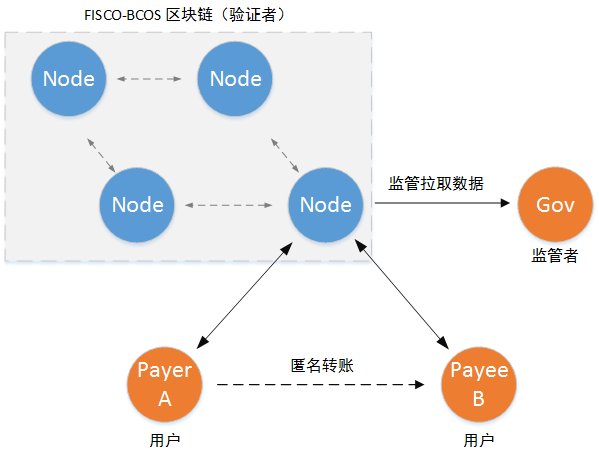

# 可监管的零知识证明说明

FISCO-BCOS提供了一种可被监管的零知识证明方法，为用户提供一种保护隐私的、可被验证的秘密交易框架的同时，为监管者提供监管的接口，实现对区块链上每一笔秘密交易的监管。

## 1. 概念说明

**零知识证明**，是示证者在不暴露自身秘密信息的情况下，通过某种方式，让验证着相信其拥有此秘密信息。

**区块链上的零知识证明**，是用户对自身需要保密但却需要被验证的数据进行转化，转化成proof提供给区块链节点。区块链节点在不知晓用户秘密数据的情况下，验证此秘密数据的正确性。任何人都不能通过proof推测出用户的秘密数据，在区块链上实现了一种可被区块链节点验证的秘密操作，但存在监管风险。

**FISCO-BCOS的可监管零知识证明**，是用户在FISCO-BCOS区块链上进行的任何一次零知识证明操作，都可以被监管者解密，受到监管者的监管。FISCO-BCOS区块链节点是零知识证明操作的验证着。

## 2. 底层库

[libzkg：可监管的零知识证明库](https://github.com/FISCO-BCOS/libzkg)

## 3. 实现场景

**（1）一对一匿名可监管转账**

用户可在FISCO-BCOS上进行匿名转账，在不暴露身份和交易金额的情况下，实现可被区块链验证的金额划转。同时，监管者可解密所有匿名转账信息。相关工程的说明与部署方法：[zkg-tx1to1](https://github.com/FISCO-BCOS/zkg-tx1to1)

**（2）开发中...**