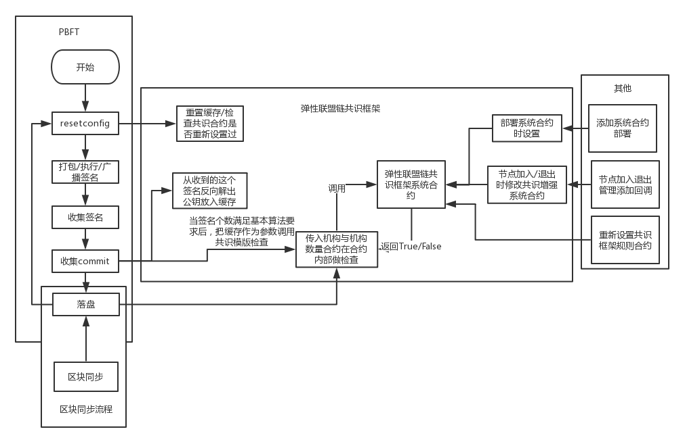

# 弹性联盟链共识框架方案

**作者：fisco-dev**

## 简介

弹性联盟链共识框架是为了弥补pbft/raft的共识仅对对等节点生效，而无法根据业务逻辑做出一些特化的缺陷所做出的措施。

因为在纯正的pbft/raft的共识模型中，首先就假设每个节点都是平等的，即没有节点具有特殊的业务性质。在联盟链中这样的性质有时并不能满足一些业务场景的要求，故而需要一套在正常的共识流程之外(保证正常共识)继续对共识流程做出限制的规则。这就是弹性联盟链共识框架方案开发的初始原因。

例如如下场景：

> 在一个10(3f+1)个节点组件的联盟链场景中，使用pbft共识算法进行共识。其中10个节点分别由A，B，C三个机构分别持有，A机构有4个节点，B机构有3个节点，C机构有3个节点。根据pbft的性质，达成共识只需要7个节点就足够了(2f+1)，因为pbft对于所有节点都是平等的，所以只需要收够10个节点中的任意7个即可。如果一次投票中的7个节点全部都是A机构和B机构的节点，那么就相当于C机构没有参加共识但是共识仍然还是通过了。所以在这样的情况下就需要额外的规则来限制共识条件，以满足业务层面上的共识要求。

**注：这是一个危险的功能，请在正确认识其原理的情况下使用，否则可能轻易导致共识无法运行下去造成链的作废！请一定仔细阅读《多机构弹性共识方案设计》章节及这个章节中的《4.其他注意事项》章节中的内容。**

## 共识的类别

在现有的方案探究及对区块链共识本质的理解下，我们划分对“共识”的界限，认为共识分为以下两类：

### 数据共识

参照 [区块链前沿|上交所朱立：许可链的性能优化](http://mp.weixin.qq.com/s/ZZA-FKWGvqzuWl4CLEwIRA)

这篇文章中的描述，认为

> 区块链中其实存在两个独立层面的共识，其一可称为“输入共识”，其含义是各节点对指令的顺序及内容达成共识，类似传统数据通信的会话层，不牵涉业务操作；其二可称为“输出共识”，其含义是业务系统受输入的驱动，状态不断发生跃迁，同时产生一系列输出，此时各参与方对业务系统进入的状态及产生的输出达成共识 。此非孤明之见，Corda 区分交易的uniqueness和validity二者[17]， Polkadot区分cononicality与validity二者，都应是有见于此。
> 虽然这两层共识在设计上可以分离，但不同区块链对此的回应差别很大，将其说为区块链设计时面临的一大抉择也不为过。总的来说有三种方式：
>
> 第一种方式是只提供输入共识，此以Factom[18]项目为例。Factom只对数据内容和顺序进行共识，把对数据的后续检验及处理交给其他应用程序完成。由于不做输出共识，这种区块链很可能不内置智能合约功能。
>
> 第二种方式是以紧耦合的方式同时提供输入共识和输出共识，典型案例如以太坊。以太坊的区块头中不仅包含交易根，也包含状态根，通过一套机制同时达成对交易和终态的共识。
>
> 第三种方式是以分离的方式同时提供输入共识和输出共识，典型案例如Fabric 1.0[19]的设计。在Fabric 1.0中，输入共识在Orderer之间达成，Orderer只看到数据，并不理解任何业务含义，输出共识则通过Endorsor、Committer和应用层CheckPoint在一定程度上实现。

因现有的模型继承于以太坊体系，我们认为事实上这里的“输入共识”和“业务共识”都归属于共识框架层面的“数据共识”，表示对于相同的一笔交易，对于这笔交易及其执行的结果，应该在所有的副本上都是一致的，并通过共识算法保证这个要求成立。其中：

- 在每个副本上的同一条交易是相同的
- 对同一条交易的执行结果是相同的

在这两个条件下，所谓“作恶”的可能性为：

- 节点故意丢弃交易(相当于同一条交易没有同步到所有节点上)
- 节点执行交易结果不一致(故意修改交易内容，修改虚拟机实现，修改执行结果)

现有的共识算法下：

- pbft 
  - 因为是轮流出块，可以防止第一个作恶(但是注意要是遵照原算法来说，同样无法防止估计丢弃交易)
  - 可以防止第二个作恶
- raft
  - raft是固定leader出块，所以无法防止第一个作恶(但是若修改raft算法使得leader可以切换，可能可以防止，但是raft的本质就是一个强leader的特性，所以这一点存疑)
  - 虽然raft本身无法保证对结果的共识，但是我们实现的raft的方式并没有使用raft的日志同步，而是依托于以太坊区块链自身的同步区块机制，这个同步机制会丢弃和自己交易执行结果不一致的区块，所以只需要修改目前的raft算法可以做到对第二点作恶的防护。

以上，我们归结为“数据共识”

### 业务共识

注意这里的业务共识不是上一章中引用内容中的“业务共识”的概念。这里的业务共识专门指代：
在业务层面上对数据共识 **结果的数据** 进行解读的共识

以存证为例：假设有3家机构，3家机构按照存证的业务模式进行协调

- 数据共识：每个节点副本执行pbft/raft共识后上链的数据
- 业务共识：当3家机构对于同一笔证据都进行了签名之后这个证据生效

以对用户信用评分为例：假设有3个公司联合对用户信用评级，评级方式是以每个用户为一个合约，合约中有一个数组，每家公司向数组中写入对改用户的分数，最后大家取平均分作为用户评分。

- 数据共识：每个节点副本执行pbft/raft共识后上链的数据
- 业务共识：当3家机构都对用户评级后，用户的信用才会生效

以上，我们归结为“业务共识”

## 弹性联盟链共识框架方案设计

在定义了业务共识的基础上，我们引入弹性联盟链共识框架方案，即在现有的共识上添加可以**由用户编写的规则**来限制共识是否成功。

**目前这个功能只用于PBFT，RAFT还未支持。**

**注：弹性联盟链共识框架方案是在基础共识的模型上新添加的规则，也就是说需要先满足基础的共识，再满足共识框架规定的规则。**

在联盟链的语境下，我们一般认为：联盟链的节点是由各个参与区块链的**“机构”**来控制，在物理上认为节点只是组成区块链的组件，在逻辑上认为参与区块链的应该是**机构**。 

所以我们认为参与业务共识的基本元素应该为**机构**和这个**机构的个数**(也就是不再以节点为共识判定的元素)，这样的模型可以覆盖比较大量的场景。

#### 适用的场景：

1. 每家机构必须具备平等的投票权，投票权和投入节点数量无关。比如每个机构都是一票。
2. 共识必须有所有机构都参与，谁都不能缺席。比如存证场景，必须提供证据的，第三方鉴证，仲裁机构都要参加。
3. 共识过程里有些机构必须参加，有些机构可选参加。比如某个场景，司法机构的签名必须存在，否则共识不能达成。
4. 和1不同，机构之间并非完全平等，每个机构具备不同的投票权重，但是不采用节点数表示，而是由签名的加权值表示，比如机构A虽然只投出一票，但是权重为3，机构B一票的权重为2，机构C的权重为1，等等。类似PoS的思想
5. 等等......

等等类似的场景。以上的场景都可以编写为“规则”来加强现有的共识体系。由于在不同的场景下需要不同的规则，所以我们需要提供一个框架来让用户可以根据自己业务的需要来部署不同的规则以达到目的。

#### 弹性联盟链共识框架方案的设计思路



如图所示，以PBFT为例，在执行完pbft的最后阶段时，我们将收集到的签名作为参数来调用一个特殊的系统合约进行“规则”的判定。当判定成功时，表示满足规则，判定失败时，表示收集到的签名还未满足。若还会继续收到共识的包那么会继续进行判定，若是共识包都发送完全，但是仍然未满足条件，那么这个块是无法完成共识阶段，也无法落地的。

举例：

> 若4个节点分别归属于4个机构，然后规则现在设定为必须有A机构的签名才算共识完成。那么比如一个节点收到了除A机构的另两个节点的共识包的时候，按照pbft的模型，加上自己的一票总共3票的时候就已经共识完成了。但是由于弹性联盟链共识框架的限制，此时会判定当前的共识没有完成，需要继续收到A机构的共识包才可判定共识完成。

### 弹性联盟链共识框架的使用方式

#### 一、启用方式

这个功能的添加是通过系统合约来实现。

机构的名字指定是在节点注册

```shell
babel-node tool.js NodeAction registerNode xxx.json
```

中 xxx.json 中的 `Agencyinfo`字段，**当这个字段一致时，标识这两个节点为同一个机构。**

##### 在已经存在的链上启用这个功能

若是在已有的链上需要启用这个功能，那么需要重新部署系统合约(或重新部署NodeAction.sol合约替换现有的节点管理合约并执行`setSystemAddr()`将系统合约设置进去)，之后重新注册节点进入系统，然后再部署规则(见后文)。

##### 在新链上启用这个功能

只需要按照文档正常部署系统合约即可，在`systemcontractv2`目录下运行：

```
bable-node deploy.js
```

#### 二、使用规则

所有和该功能相关的合约与脚本工具都位于`systemcontractv2`目录下

##### 1.编写规则

用户需要根据自己的需要，编写自己的规则。编写规则的文件为在`systemcontractv2`目录下的`ConsensusControl.sol`文件中的函数：

ConsensusControl.sol:

```javascript
pragma solidity ^0.4.11;
import "ConsensusControlAction.sol";
contract ConsensusControl is ConsensusControlAction {
  	// 构造函数一定需要存在
    function ConsensusControl (address systemAddr) ConsensusControlAction (systemAddr) {
    }
  	// 用户编写自己规则的函数，true代表满足规则，false代表不满足规则，参数 bytes32[] info 代表已经收到的机构的列表， uint[] num 代表已经收到的共识包中这些机构分别的个数(与info是对应关系)
    function control(bytes32[] info, uint[] num) external constant returns (bool) {
            return true;
    }
    // 初始化时的回调
    function init(address systemAddr) internal {}
    // NodeAction 加入节点的回调，true代表同意这个节点加入，false代表拒绝这个节点加入
  	// babel-node tool.js NodeAction registerNode xxxx.json
    function beforeAdd(bytes32 agency) internal returns (bool) {
        return true;
    }
    // NodeAction 退出节点的回调，true代表同意这个节点退出，false代表拒绝这个节点退出
  	// babel-node tool.js NodeAction cancelNode xxxx.json
    function beforeDel(bytes32 agency) internal returns (bool) {
        return true;
    }
}
```

用户通过编写填充这个合约中的函数来达成自己目的。

我们以 4 个节点构成链举例，其中 A 机构由2个节点，B机构1个节点，C机构1个节点。

在这个框架中：

* 文件名(ConsensusControl.sol)不可以更改
* 构造函数一定不能删除，且参数一定是address
* 父类`ConsensusControlAction`会提供两个成员变量  `bytes32[] public agencyList` 和 `mapping (bytes32 => uint) public agencyCountMap` 分别代表当前系统中**应该**具备的机构列表`agencyList` 和这些机构**应该**有的数量。所以`agencyList=['A', 'B', 'C']` , `agencyCountMap={'A':2, 'B':1, 'C':1}` 
* `control`函数代表规则，用户通过编写这个规则来根据输入参数判定true或false来决定是否满足自己的业务共识规则，参数 `bytes32[] info` 代表已经收到的机构的列表， `uint[] num` 代表已经收到的共识包中这些机构分别的个数(与info是对应关系)。比如当前触发这次判定的时候，收到了3个共识包，其中2个是A机构的，1个是B机构的，那么 `info=['A','B']`, `num=[2,1]`
* `init`代表刚部署该合约时触发的回调
* `beforeAdd` 代表注册新节点时，可以通过这个函数处理是否可以让这个节点加入，比如需要限制每个机构的最大数量
* `beforeDel`代表节点退出时，可以通过这个函数处理是否可以让这个节点退出，比如规则为某个机构必须在时才能通过，那么这个函数可以限制这个机构至少要有一个在区块链中才行，否则这条链就无法共识了。
* 修改规则即重新编写 `control init beforeAdd beforeDel`这几个函数，并重新部署。

按照上述介绍，我们列举两种可能的场景的编写规则方式：

###### 1)所有机构都必须参与共识

```javascript
pragma solidity ^0.4.11;
import "ConsensusControlAction.sol";

/**
 * 要求所有机构都有签名 
 */
contract ConsensusControl is ConsensusControlAction {
    function ConsensusControl (address systemAddr) ConsensusControlAction (systemAddr) {
    }
    
    function control(bytes32[] info, uint[] num) external constant returns (bool) {
        uint count = 0;
        for(uint i=0; i < info.length; i++) {
            //agencyCountMap[info[i]] != 0 存在这个机构
            // num[i] != 0 这个机构传进来个数大于0
            if (agencyCountMap[info[i]] != 0 && num[i] != 0) { 
                count += 1;
            }
        }
        if (count < agencyList.length)
            return false;
        else
            return true;
    }
    // init beforeAdd beforeDel 在这里不起作用，所以不进行覆写
}
```

###### 1)必须有一个指定的机构参与共识

如指定的机构叫做 AgencyA

```javascript
pragma solidity ^0.4.11;

import "ConsensusControlAction.sol";
/**
 * 要求 AgencyA 必须有签名
 */
contract ConsensusControl is ConsensusControlAction {
  	string private agencyName = "AgencyA";
    function ConsensusControl (address systemAddr) ConsensusControlAction (systemAddr) {
    }
    
    function control(bytes32[] info, uint[] num) external constant returns (bool) {
        bool isexisted = false;
        for(uint i=0; i < info.length; i++) {
            if (info[i] == stringToBytes32(agencyName) && num[i] > 0) {
                isexisted = true;
                break;
            }
        }
        return isexisted;
    }
    // 使用 beforeDel 限制 AgencyA 的节点退出
    function beforeDel(bytes32 agency) internal returns (bool) {
        // reject del the last "AgencyA" node
        if (agency == stringToBytes32(agencyName)){
            var count = agencyCountMap[agency];
            if (count - 1 <= 0) {
                return false;
            }
        }
        return true;
    }
}
```

##### 2. 部署规则，关闭规则，列出当前机构列表

我们提供了 `ConsensusControlTool.js`工具来控制规则，改脚本有3个指令'deploy', 'turnoff' 和 'list'

当经过1步我们指定好或修改好规则时候，执行

```shell
babel-node ConsensusControlTool.js deploy
```

可以把1中的规则合约进行部署。若是想替换规则也同样执行这个指令

当我们需要关闭共识规则时，执行

```shell
babel-node ConsensusControlTool.js turnoff
```

当我们需要列出当前系统中的机构列表及机构数目时，执行

```shell
babel-node ConsensusControlTool.js list
```

##### 3. 相关日志查看

这个模块相关的日志全部以 `[ConsensusControl]`作为开头。其中在合约中也可以编写日志输出(详细使用见合约日志输出相关文章)，如：

```javascript
pragma solidity ^0.4.11;

import "ConsensusControlAction.sol";
import "LibEthLog.sol";
contract ConsensusControl is ConsensusControlAction {
    using LibEthLog for *;

    function ConsensusControl (address systemAddr) ConsensusControlAction (systemAddr) {
        LibEthLog.DEBUG().append("[ConsensusControl] ######### current agency list ######## length:").append(agencyList.length).commit();
        // for (uint i=0; i < agencyList.length; i++) {
        //     LibEthLog.DEBUG().append("[ConsensusControl]").append(i)
        //     .append(":")
        //     .append(bytes32ToString(agencyList[i]))
        //     .append(":")
        //     .append(agencyCountMap[agencyList[i]])
        //     .commit();
        // }
        // LibEthLog.DEBUG().append("[ConsensusControl] ######### end ########:").commit();
    }
}
```

即可输出debug日志。

##### 4. 其他注意事项

1. 机构的名字一定使用英文，并且不能超过`bytes32`的限制(solidity的限制)
2. **在工程上节点的部署一定要保证和规则要求相关**，比如当规则规定某个机构必须签名时，**这个机构**的节点一定要保证多活，否则会导致共识无法继续。比如当规则规定所有机构都要签名时，**每个机构**的节点**都要**保证多活。**因为实现上的关系，若由于规则的限制而同时不能保证满足规则的意外场景发生时，会让系统陷入死锁。**比如4个节点分别归属4个机构，然后必须要求其中一个机构签名。因为这个机构只有一个节点，那么当这个节点无法工作时，规则会判定共识失败。若不能在短时间内恢复这个节点，那么一段时间后，即使再次恢复这个节点，也无法使整个系统继续工作，因为此时整个系统已经陷入了死锁。所以在工程上目前需要保持这个机构一定要多活(即规则限定的条件要满足)。若在意外的情况下触发了这一条，那么目前只能把所有节点都重新启动可恢复。**在下个版本会改进这个缺陷**。
3. **重要！！！**部署规则的时候一定要仔细检查规则是否能够正常运行，否则若部署了一个错误的规则的时候可能会导致链的作废(举例：若当前规则为指定某个机构必须签名，但是这个链的体系中并没有这个机构存在，那么若部署了这个合约，则会导致无法出块。)


## 在老链(已有数据的链)上兼容或启用弹性联盟链共识框架

**该功能的添加不会影响到已有的功能，与已有的数据相兼容，所以当编译出新的执行文件的时候，直接替换已有的执行文件重启后即可。但是这样不会具备弹性联盟链共识框架这个功能，只是保证不会影响其他功能。**

若希望在已有的链上启用这个新的功能，则要求**重新部署系统合约**，或至少重新部署 `NodeAction.sol` 及 `ConsensusControlMgr.sol`，并将这两个合约重新注册到已有的系统合约中，之后才能使用 `ConsensusControlTool.js` 工具

也就是说在已有的链中替换了新版本的执行文件并希望启用该功能，需要：
* 重新部署一次系统合约，并重新执行之前对系统合约管理过的组件相关操作，并把**除了**`NodeAction.sol`之外的**原来的系统合约所管理的合约组件**重新注册到新的系统合约中(首先先获取原系统合约管理组件的地址及对应关系，并参考 systemcontractv2/deploy.js 文件的写法重新注册到新系统合约中)，之后重新按照原来添加节点的方式重新添加节点恢复到原来的连接状态
* 重新部署 `NodeAction.sol` 及 `ConsensusControlMgr.sol`(参考 systemcontractv2/deploy.js 文件)，并将这两个合约重新注册到已有的系统合约中，并重新按照原来添加节点的方式重新添加节点恢复到原来的连接状态