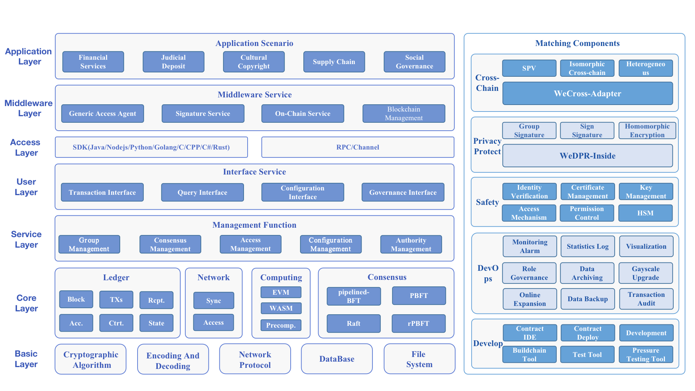

[中文](../README.md) / English

FISCO BCOS (pronounced /ˈfɪskl bi:ˈkɒz/) is an enterprise-level financial blockchain platform developed and open-sourced by the Financial Services Blockchain Consortium (Shenzhen) "FISCO" led by WeBank. 

In a single-chain configuration, the performance can reach more than 100k TPS. FISCO BCOS provides rich features including group architecture, parallel computing, distributed storage, pluggable consensus mechanism, privacy protection algorithms, and OSCCA-approved cryptography modules.

FISCO BCOS is a stable, efficient, and secure blockchain underlying platform. Its usability has been widely verified by practical applications, and many benchmark applications have been implemented in various industries.

## System Overview
The architecture of FISCO BCOS system consists of the basic layer, core layer, service layer, user layer, and access layer on the left-hand side, providing stable and secure blockchain underlying services. The middleware layer simplifies the process of managing the blockchain system through a visual interface. On the right-hand side, there are supporting components for development, operation, and security control, meeting the needs of different roles during the application implementation process. Meanwhile, privacy protection and cross-chain-related technology components are also provided to satisfy the application requirements in different scenarios.

### Underlying Features

- Blockchain File System: WYSIWYG contract data management
- Distributed Storage TiKV: Distributed transactional submission, supporting massive storage
- Pipelined: Block pipeline, generating blocks continuously and compactly
- Pluggable Consensus Mechanism: Designed a pluggable consensus framework, flexible and optional
- Permission Governance Framework: Built-in permission governance framework, multi-party voting to govern the blockchain
- SDK Basic Library: Multi-language SDK, more convenient access to national cryptographic algorithms on all platforms

### Component Services

- Privacy Protection: WeDPR, a scenario-based privacy protection solution that is even available
- Cross-chain Collaboration: WeCross, a cross-chain collaboration platform that supports multi-chain interoperability
- Blockchain Management: WeBASE, a visual blockchain management platform

### Development and Operation Tools

- Deployment Tool: One-click chain-building script, automated deployment of blockchain
- Visualization Tool: Provides visualization management tools to reduce operational procedures
- Monitoring and Alarm Tool: Monitors the running status of the blockchain system and alarms in real-time
- Data Archiving Tool: Cold data archiving, supporting RocksDB and TiKV, releasing storage pressure.

## Documentation

[《The FISCO BCOS Official Technical Documentation》](https://fisco-bcos-doc.readthedocs.io/zh_CN/latest/index.html) provides chain development guidelines, tool introductions, and design principle explanations. Users can quickly learn and use FISCO BCOS by reading the official technical documentation.

The documentation covers the following topics:
1. [Quick Start](https://fisco-bcos-doc.readthedocs.io/zh_CN/latest/docs/quick_start/hardware_requirements.html)
2. [Contract Development](https://fisco-bcos-doc.readthedocs.io/zh_CN/latest/docs/contract_develop/solidity_develop.html)
3. [SDK Tutorial](https://fisco-bcos-doc.readthedocs.io/zh_CN/latest/docs/sdk/index.html)
4. [Chain Deployment Tutorial](https://fisco-bcos-doc.readthedocs.io/zh_CN/latest/docs/tutorial/air/index.html)
5. [Application Development](https://fisco-bcos-doc.readthedocs.io/zh_CN/latest/docs/develop/index.html)
6. [Blockchain Operation and Maintenance Tools](https://fisco-bcos-doc.readthedocs.io/zh_CN/latest/docs/operation_and_maintenance/build_chain.html)
7. [Advanced Feature Usage](https://fisco-bcos-doc.readthedocs.io/zh_CN/latest/docs/advanced_function/safety.html)
8. [Design Principles](https://fisco-bcos-doc.readthedocs.io/zh_CN/latest/docs/design/architecture.html)

If you need to refer to the relevant information of FISCO BCOS 2.x version, you can refer to the [FISCO BCOS 2.x Technical Documentation](https://fisco-bcos-documentation.readthedocs.io/zh_CN/latest/)

## Featured application

**FISCO BCOS** has been adopted in over hundreds of applications in areas like government affairs, finances, charity, health care, education, transport, copyright, product tracing, supply chain, recruitment, agriculture, social communication, and entertainment.

- **Finance**: inter-institutional reconciliation, supply chain finance, tourism finance, etc.
- **Judicial Deposit**: arbitration chain, digital IOUs, etc.
- **Cultural Copyright**: copyright registration and trading, etc.
- **Social Management**: real-estate registration, community governance etc.
- **Rural Revitalization**: Construction of smart agriculture and animal husbandry big data cloud platforms, digital platforms, etc.
- **Smart Governance**: City brain, provident fund blockchain platform, digital certification projects, etc.

## Join our community

The FISCO BCOS open source community is a thriving and expansive community in China. Since its inception, the open source community built around FISCO BCOS has united more than 4,000 enterprises and institutions, along with over 90,000 individual members, to collaborate and share resources. The community has successfully supported hundreds of blockchain application scenarios across key industries such as government affairs, finance, agriculture, public welfare, entertainment, supply chain, and the Internet of Things. With over 300 benchmark applications collected, the community has formed a large and active open source alliance chain ecosystem.

If you have an interest in FISCO BCOS open source technology and applications, we invite you to join the community and take advantage of the support and resources available.

## Contributing code

- Your contributions are most welcome and appreciated. Please read the [contribution instructions](https://mp.weixin.qq.com/s/_w_auH8X4SQQWO3lhfNrbQ).
- If this project is useful to you, please star us on GitHub project page!

## License

All contributions are made under the Apache License 2.0, see [LICENSE](../LICENSE) for details.
