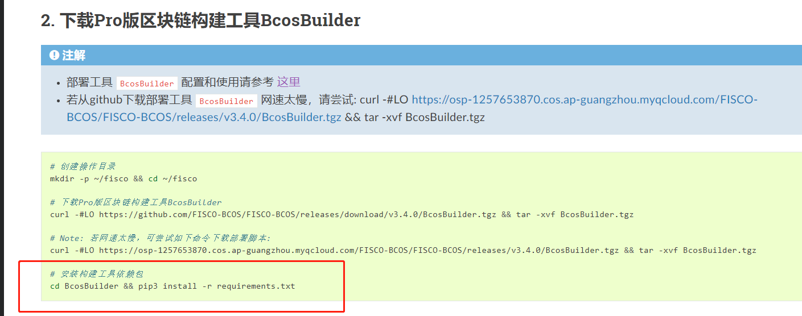
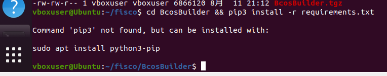
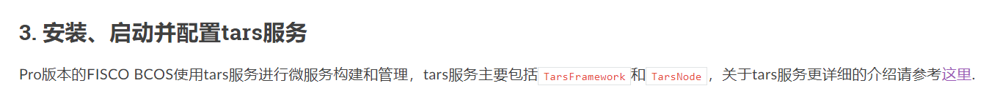
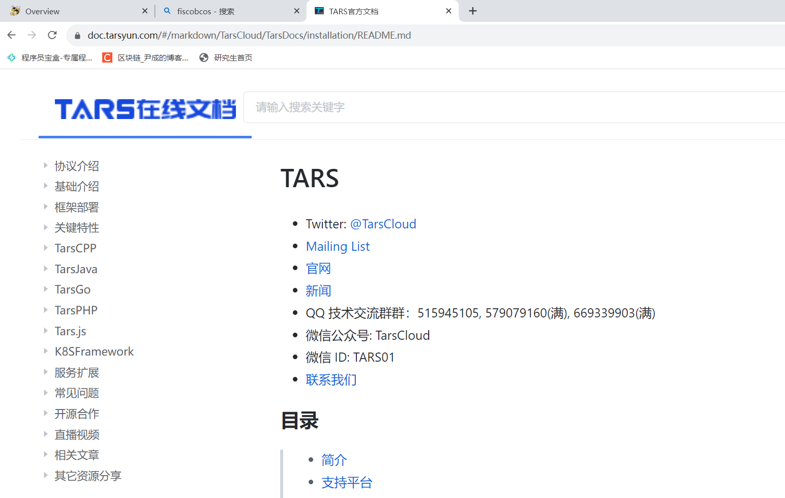
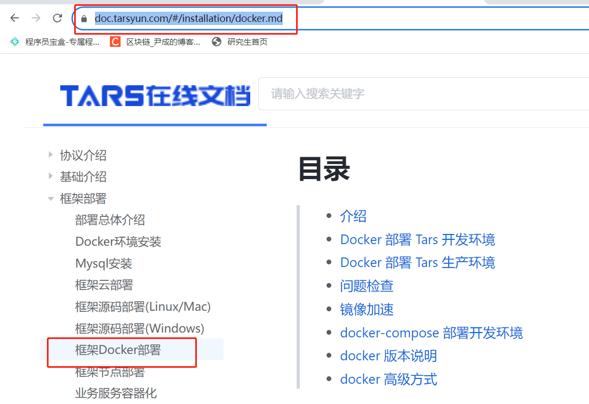
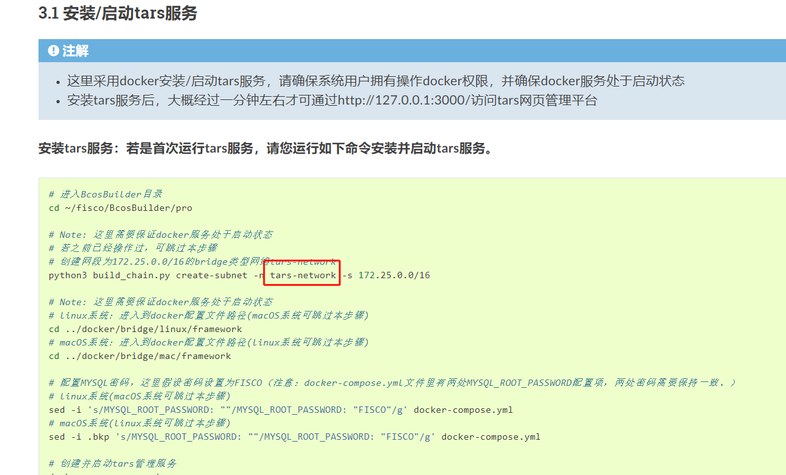
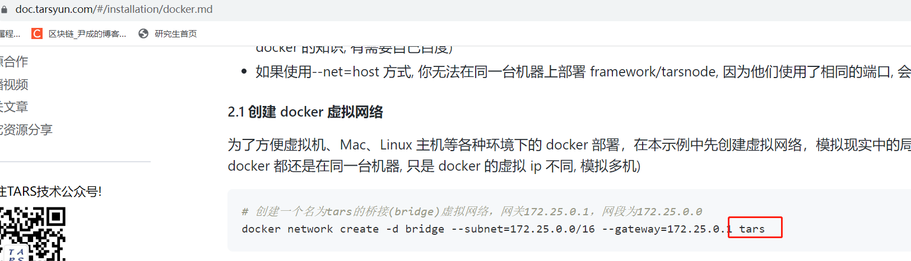
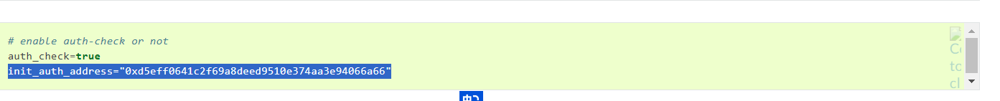
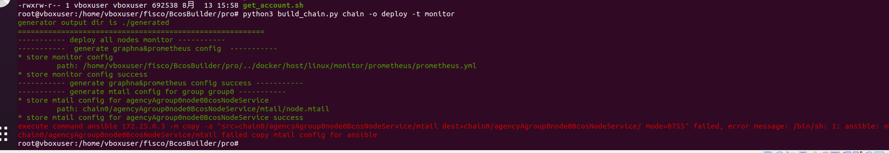

使用pro建链工具搭建fisco bcos区块链

环境：Ubunutu 20.04.5TLS

网络：单机

问题一：在执行下图第三个步骤时，报错

报错信息如下：

解决如下：
sudo apt install python3-pip

问题二：给定tars服务的安装和启动步骤不明确。

1.上图地址对应的跳转页面如下图，需用户自己找到对应的地址搭建docker环境。

解决方案：
建议将tars的详细介绍以及框架docker部署分别给出地址，对应docker框架地址如下图。

2.给定启动tars-network与给定链接中创建的网络名称不一致，导致搭建起tars网络后，要启动docker tar服务才发现网络名称对应不上。如下面两图所示：

解决方案：
因担心创建的docker tars服务网络名称与步骤名称不一致会导致后续步骤出问题，故而将创建的命名为tars网络删掉，重新创建名称为tars-network的桥接网络。
同时需注意后续创建mysql服务以及tars-node节点服务都需将网络名称改为对应的tars-network。下面给出所有执行的命令

1.创建桥接网络 tars-network

docker network create -d bridge --subnet=172.25.0.0/16 --gateway=172.25.0.1 tars-network

2.启动mysql 5.6版本

docker run -d -p 3306:3306 \
--net=tars-network \
-e MYSQL_ROOT_PASSWORD="123456" \
--ip="172.25.0.2" \
-v /data/framework-mysql:/var/lib/mysql \
-v /etc/localtime:/etc/localtime \
--name=tars-mysql \
mysql:5.6

3.拉取tarscloud/framework镜像

   docker pull tarscloud/framework:v3.0.15

4.启动tars-framework服务

docker run -d \
--name=tars-framework \
--net=tars-network \
-e MYSQL_HOST="172.25.0.2" \
-e MYSQL_ROOT_PASSWORD="123456" \
-e MYSQL_USER=root \
-e MYSQL_PORT=3306 \
-e REBUILD=false \
-e INET=eth0 \
-e SLAVE=false \
--ip="172.25.0.3" \
-v /data/framework:/data/tars \
-v /etc/localtime:/etc/localtime \
-p 3000:3000 \
-p 3001:3001 \
tarscloud/framework:v3.0.15

5.拉取tars节点镜像

docker pull tarscloud/tars-node:latest
6.启动tars-nodes服务
docker run -d \
--name=tars-node \
--net=tars-network \
-e INET=eth0 \
-e WEB_HOST="http://172.25.0.3:3000" \
--ip="172.25.0.5" \
-v /data/tars:/data/tars \
-v /etc/localtime:/etc/localtime \
-p 9000-9010:9000-9010 \
tarscloud/tars-node:latest

问题三.下图配置没有说明在哪里去配置

解决方案：
找到pro下的config.toml，通过搜索可找到init_auth_address

问题四.配置和启动控制台时报错

解决方案：
暂无找到解决方案