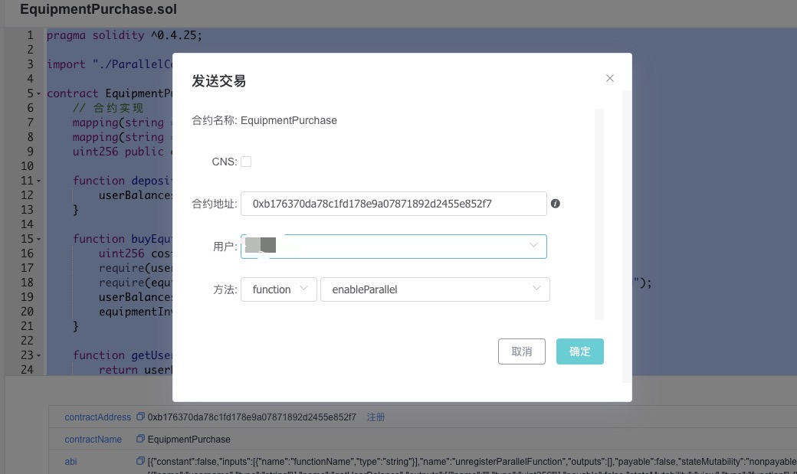
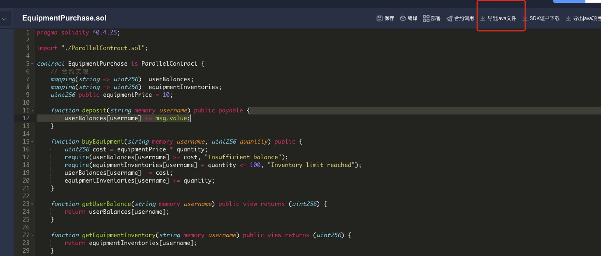
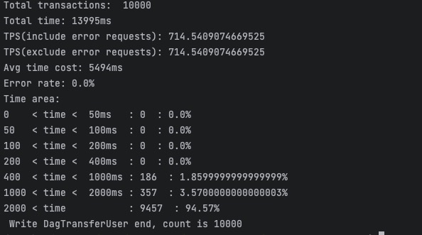
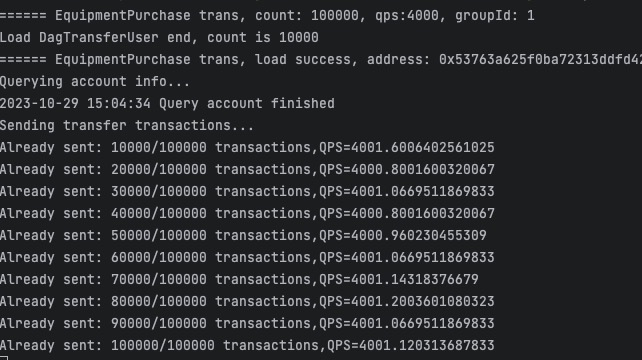
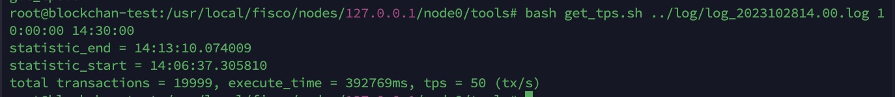

## 概述：

FISCO BCOS提供了可**并行**合约开发框架，开发者按照框架规范编写的合约，能够被FISCO BCOS节点并行地执行。并行合约的优势有：

- 高吞吐：多笔独立交易同时被执行，能最大限度利用机器的CPU资源，从而拥有较高的TPS
- 可拓展：可以通过提高机器的配置来提升交易执行的性能，以支持不断扩大业务规模

[官网链接](https://fisco-bcos-documentation.readthedocs.io/zh-cn/latest/docs/manual/transaction_parallel.html?highlight=%E5%B9%B6%E8%A1%8C)

## 预备知识：

官网的解释是两笔交易能执行并行的标准是两笔交易是否存在互斥。也就是说两笔交易各自操作合约存储变量的时候，他们的集合存在交集，则判断为互斥。在转账的场景中，用transfer(X, Y) 表示从X用户转到Y用户的转账接口，则互斥情况如下。

| 交易                             | 互斥对象         | 交集   | 是否互斥               |
| -------------------------------- | ---------------- | ------ | ---------------------- |
| transfer(A, B) 和 transfer(A, C) | [A, B] 和 [A, C] | [A]    | 互斥，不可**并行**执行 |
| transfer(A, B) 和 transfer(B, C) | [A, B] 和 [B, C] | [B]    | 互斥，不可**并行**执行 |
| transfer(A, C) 和 transfer(B, C) | [A, C] 和 [B, C] | [C]    | 互斥，不可**并行**执行 |
| transfer(A, B) 和 transfer(A, B) | [A, B] 和 [A, B] | [A, B] | 互斥，不可**并行**执行 |
| transfer(A, B) 和 transfer(C, D) | [A, B] 和 [C, D] | 无     | 无互斥，可**并行**执行 |

此处给出更具体的定义：

- **互斥参数**：合约**接口**中，与合约存储变量的“读/写”操作相关的参数。例如转账的接口transfer(X, Y)，X和Y都是互斥参数。
- **互斥对象**：一笔**交易**中，根据互斥参数提取出来的、具体的互斥内容。例如转账的接口transfer(X, Y), 一笔调用此接口的交易中，具体的参数是transfer(A, B)，则这笔操作的互斥对象是[A, B]；另外一笔交易，调用的参数是transfer(A, C)，则这笔操作的互斥对象是[A, C]。

**判断同一时刻两笔交易是否能\**并行\**执行，就是判断两笔交易的互斥对象是否有交集。相互之间交集为空的交易可并行执行。**

## 并行合约：

官网上提供了ParallelContract.sol代码如下：

```solidity
pragma solidity ^0.4.25;

contract ParallelConfigPrecompiled
{
    function registerParallelFunctionInternal(address, string, uint256) public returns (int);
    function unregisterParallelFunctionInternal(address, string) public returns (int);    
}

contract ParallelContract
{
    ParallelConfigPrecompiled precompiled = ParallelConfigPrecompiled(0x1006);
    
    function registerParallelFunction(string functionName, uint256 criticalSize) public 
    {
        precompiled.registerParallelFunctionInternal(address(this), functionName, criticalSize);
    }
    
    function unregisterParallelFunction(string functionName) public
    {
        precompiled.unregisterParallelFunctionInternal(address(this), functionName);
    }
    
    function enableParallel() public;
    function disableParallel() public;
}
```

我们来看看这段代码，

在合约中，定义了一个名为 `precompiled` 的变量，类型是 `ParallelConfigPrecompiled`，并且初始化为合约地址为 `0x1006` 的 `ParallelConfigPrecompiled` 合约，ParallelConfigPrecompiled属于预编译合约，用于Solidity中合约并行接口配置。


其中定义了两个函数，分别为：registerParallelFunction和unregisterParallelFunction，看字面意思分别为注册和注销。

1. `registerParallelFunction` 函数：

   - 这个函数用于注册一个可并行执行的函数，以便在并行处理多个交易。它的定义如下：

     ```
     solidityCopy code
     function registerParallelFunction(string functionName, uint256 criticalSize) public
     ```

   - `functionName` 参数是要注册的函数的名称，它以字符串的形式传递。

   - `criticalSize` 参数表示前几个为互斥参数，用于确定哪些交易可以同时执行。

   - 在函数内部，它通过调用 `precompiled` 合约的 `registerParallelFunctionInternal` 函数来实际执行注册操作。这个函数的作用是向 `ParallelConfigPrecompiled` 合约注册一个可并行执行的函数。

2. `unregisterParallelFunction` 函数：

   - 这个函数与 `registerParallelFunction` 函数相反，用于注销已经注册的可并行执行的函数。它的定义如下：

     ```
     solidityCopy code
     function unregisterParallelFunction(string functionName) public
     ```

   - `functionName` 参数是要注销的函数的名称，以字符串的形式传递。

   - 当不再需要某个函数可以并行执行时，可以调用这个函数来取消注册，从而确保该函数之后不会再被多个交易同时执行。

   - 类似于 `registerParallelFunction`，在函数内部，它通过调用 `precompiled` 合约的 `unregisterParallelFunctionInternal` 函数来实际执行注销操作。


我们可以看看官方给出的使用例子：

```solidity
pragma solidity ^0.4.25;

import "./ParallelContract.sol";  // 引入ParallelContract.sol

contract ParallelOk is ParallelContract // 将ParallelContract 作为基类
{
    // 合约实现
    mapping (string => uint256) _balance;
    
    function transfer(string from, string to, uint256 num) public
    {
        // 此处为简单举例，实际生产中请用SafeMath代替直接加减
        _balance[from] -= num;
        _balance[to] += num;
    }

    function set(string name, uint256 num) public
    {
        _balance[name] = num;
    }

    function balanceOf(string name) public view returns (uint256)
    {
        return _balance[name];
    }
    
    // 注册可以并行的合约接口
    function enableParallel() public
    {
        // 函数定义字符串（注意","后不能有空格）,参数的前几个是互斥参数（设计函数时互斥参数必须放在前面
        registerParallelFunction("transfer(string,string,uint256)", 2); // critical: string string
        registerParallelFunction("set(string,uint256)", 1); // critical: string
    } 

    // 注销并行合约接口
    function disableParallel() public
    {
        unregisterParallelFunction("transfer(string,string,uint256)");
        unregisterParallelFunction("set(string,uint256)"); 
    } 
}
```


该合约继承了`ParallelContract` 合约。

合约用`mapping (string => uint256) _balance`存储账户余额的映射

在`transfer(string from, string to, uint256 num)`: 来实现转账操作的函数。它接受三个参数：`from`（转出账户名）、`to`（转入账户名）和 `num`（转账金额）

`set(string name, uint256 num)`: 这个函数用于设置账户余额。它接受两个参数：`name`（账户名）和 `num`（要设置的余额值）


下面enableParallel和disableParallel分别就是用来处理并行逻辑的操作。

1. `enableParallel` 函数：这个函数用于注册可以并行执行的合约接口。它调用 `registerParallelFunction` 函数，注册了两个函数接口，即 `transfer` 和 `set`。同时，它指定了哪些参数是互斥参数以及它们的数量，从而允许系统知道哪些函数可以同时执行。
2. `disableParallel` 函数：这个函数用于注销已经注册的并行合约接口。它通过调用 `unregisterParallelFunction` 函数，取消注册了 `transfer` 和 `set` 函数，让其不再可并行执行。


## 开发并行合约：


基于上面例子，我想到了其实有很多的场景需要用到并行合约，尤其是购买物品方面，比如多用户游戏在线装备商城，仓库设备购买平台，或者一些电商的购物网站。

我简单设计一个骨架来模拟这些购买行为：

### EquipmentPurchase

这是对应的合约：

```solidity
pragma solidity ^0.4.25;

import "./ParallelContract.sol";

contract EquipmentPurchase is ParallelContract {
    // 合约实现
    mapping(string => uint256)  userBalances;
    mapping(string => uint256)  equipmentInventories;
    uint256 public equipmentPrice = 10; 

    function deposit(string memory username,  uint256 num) public payable {
        userBalances[username] += num;
    }

    function buyEquipment(string memory username, uint256 quantity) public {
        uint256 cost = equipmentPrice * quantity;
        require(userBalances[username] >= cost, "Insufficient balance");
        userBalances[username] -= cost;
        equipmentInventories[username] += quantity;
    }

    function getUserBalance(string memory username) public view returns (uint256) {
        return userBalances[username];
    }

    function getEquipmentInventory(string memory username) public view returns (uint256) {
        return equipmentInventories[username];
    }

    // 注册可以并行的合约接口
    function enableParallel() public {
        registerParallelFunction("deposit(string,uint256)", 2); 
        registerParallelFunction("buyEquipment(string,uint256)", 2); 
    }

    // 注销并行合约接口
    function disableParallel() public {
        unregisterParallelFunction("deposit(string,uint256)");
        unregisterParallelFunction("buyEquipment(string,uint256)");
    }
}

```


我定义了两个mapping变量userBalances和equipmentInventories，分别用于模拟用户的余额以及用户购买设备的数量，同时用equipmentPrice定义了设备的价格。用户可以通过deposit来给自己充值余额，然后通过buyEquipment方法来购买设备，这两个方法运行用户并行操作，并行充值以及并行购买。


我们直接通过webase来编译部署，并且执行对应enableParallel方法用于注册并行操作



然后我们可以编写测试代码，顺便按照官网的要求来测一下自己搭建的链的TPS

先把它导出为对应的Java文件


我们可以按照官网给出的[java-sdk-demo](https://github.com/FISCO-BCOS/java-sdk)中来对应的测试自己的demo

### EquipmentPurchaseDemo

代码如下：

```java
public class EquipmentPurchaseDemo {

    private static final Logger logger = LoggerFactory.getLogger(ParallelOkDemo.class);
    private static AtomicInteger sended = new AtomicInteger(0);
    private AtomicInteger getted = new AtomicInteger(0);

    private SimpleDateFormat dateFormat = new SimpleDateFormat("yyyy-MM-dd HH:mm:ss");
    private final EquipmentPurchase equipmentPurchase;
    private final ThreadPoolService threadPoolService;
    private final PerformanceCollector collector;
    private final DagUserInfo dagUserInfo;

    public EquipmentPurchaseDemo(
            EquipmentPurchase equipmentPurchase, DagUserInfo dagUserInfo, ThreadPoolService threadPoolService) {
        this.threadPoolService = threadPoolService;
        this.equipmentPurchase = equipmentPurchase;
        this.dagUserInfo = dagUserInfo;
        this.collector = new PerformanceCollector();
    }

    public void veryTransferData(BigInteger qps) throws InterruptedException {
        RateLimiter rateLimiter = RateLimiter.create(qps.intValue());
        System.out.println("===================================================================");
        AtomicInteger verifyFailed = new AtomicInteger(0);
        AtomicInteger verifySuccess = new AtomicInteger(0);

        final List<DagTransferUser> userInfo = dagUserInfo.getUserList();
        int userSize = userInfo.size();
        for (int i = 0; i < userSize; i++) {
            rateLimiter.acquire();
            final int userIndex = i;
            threadPoolService
                    .getThreadPool()
                    .execute(
                            new Runnable() {
                                @Override
                                public void run() {
                                    try {
                                        String user = userInfo.get(userIndex).getUser();
                                        BigInteger balance = equipmentPurchase.getUserBalance(user);
                                        BigInteger localAmount =
                                                userInfo.get(userIndex).getAmount();
                                        if (localAmount.compareTo(balance) != 0) {
                                            logger.error(
                                                    "local balance is not the same as the remote, user: {}, local balance: {}, remote balance: {}",
                                                    user,
                                                    localAmount,
                                                    balance);
                                            verifyFailed.incrementAndGet();
                                        } else {
                                            verifySuccess.incrementAndGet();
                                        }
                                    } catch (ContractException exception) {
                                        verifyFailed.incrementAndGet();
                                        logger.error(
                                                "get remote balance failed, error info: "
                                                        + exception.getMessage());
                                    }
                                }
                            });
        }
        while (verifySuccess.get() + verifyFailed.get() < userSize) {
            Thread.sleep(40);
        }

        System.out.println("validation:");
        System.out.println(" \tuser count is " + userSize);
        System.out.println(" \tverify_success count is " + verifySuccess);
        System.out.println(" \tverify_failed count is " + verifyFailed);
    }

    public void userAdd(BigInteger userCount, BigInteger qps)
            throws InterruptedException, IOException {
        System.out.println("===================================================================");
        System.out.println("Start UserAdd test, count " + userCount);
        RateLimiter limiter = RateLimiter.create(qps.intValue());

        long currentSeconds = System.currentTimeMillis() / 1000L;
        Integer area = userCount.intValue() / 10;
        long startTime = System.currentTimeMillis();
        collector.setTotal(userCount.intValue());
        collector.setStartTimestamp(startTime);
        AtomicInteger sendFailed = new AtomicInteger(0);
        for (Integer i = 0; i < userCount.intValue(); i++) {
            final Integer index = i;
            limiter.acquire();
            threadPoolService
                    .getThreadPool()
                    .execute(
                            new Runnable() {
                                @Override
                                public void run() {
                                    // generate the user according to currentSeconds
                                    String user =
                                            Long.toHexString(currentSeconds)
                                                    + Integer.toHexString(index);
                                    BigInteger amount = new BigInteger("1000000000");
                                    DagTransferUser dtu = new DagTransferUser();
                                    dtu.setUser(user);
                                    dtu.setAmount(amount);
                                    ParallelOkCallback callback =
                                            new ParallelOkCallback(
                                                    collector,
                                                    dagUserInfo,
                                                    ParallelOkCallback.ADD_USER_CALLBACK);
                                    callback.setTimeout(0);
                                    callback.setUser(dtu);
                                    try {
                                        callback.recordStartTime();
                                        equipmentPurchase.deposit(user, amount, callback);
                                        int current = sended.incrementAndGet();

                                        if (current >= area && ((current % area) == 0)) {
                                            long elapsed = System.currentTimeMillis() - startTime;
                                            double sendSpeed = current / ((double) elapsed / 1000);
                                            System.out.println(
                                                    "Already sended: "
                                                            + current
                                                            + "/"
                                                            + userCount
                                                            + " transactions"
                                                            + ",QPS="
                                                            + sendSpeed);
                                        }

                                    } catch (Exception e) {
                                        logger.warn(
                                                "addUser failed, error info: {}", e.getMessage());
                                        sendFailed.incrementAndGet();
                                        TransactionReceipt receipt = new TransactionReceipt();
                                        receipt.setStatus("-1");
                                        receipt.setMessage(
                                                "userAdd failed, error info: " + e.getMessage());
                                        callback.onResponse(receipt);
                                    }
                                }
                            });
        }
        while (collector.getReceived().intValue() != userCount.intValue()) {
            logger.info(
                    " sendFailed: {}, received: {}, total: {}",
                    sendFailed.get(),
                    collector.getReceived().intValue(),
                    collector.getTotal());
            Thread.sleep(100);
        }
        dagUserInfo.setContractAddr(equipmentPurchase.getContractAddress());
        dagUserInfo.writeDagTransferUser();
        System.exit(0);
    }

    public void queryAccount(BigInteger qps) throws InterruptedException {
        final List<DagTransferUser> allUsers = dagUserInfo.getUserList();
        RateLimiter rateLimiter = RateLimiter.create(qps.intValue());
        AtomicInteger sent = new AtomicInteger(0);
        for (Integer i = 0; i < allUsers.size(); i++) {
            final Integer index = i;
            rateLimiter.acquire();
            threadPoolService
                    .getThreadPool()
                    .execute(
                            new Runnable() {
                                @Override
                                public void run() {
                                    try {
                                        BigInteger result =
                                                equipmentPurchase.getUserBalance(allUsers.get(index).getUser());
                                        allUsers.get(index).setAmount(result);
                                        int all = sent.incrementAndGet();
                                        if (all >= allUsers.size()) {
                                            System.out.println(
                                                    dateFormat.format(new Date())
                                                            + " Query account finished");
                                        }
                                    } catch (ContractException exception) {
                                        logger.warn(
                                                "queryAccount for {} failed, error info: {}",
                                                allUsers.get(index).getUser(),
                                                exception.getMessage());
                                        System.exit(0);
                                    }
                                }
                            });
        }
        while (sent.get() < allUsers.size()) {
            Thread.sleep(50);
        }
    }

    public void userTransfer(BigInteger count, BigInteger qps)
            throws InterruptedException, IOException {
        System.out.println("Querying account info...");
        queryAccount(qps);
        System.out.println("Sending transfer transactions...");
        RateLimiter limiter = RateLimiter.create(qps.intValue());
        int division = count.intValue() / 10;
        long startTime = System.currentTimeMillis();
        collector.setStartTimestamp(startTime);
        collector.setTotal(count.intValue());
        AtomicInteger sendFailed = new AtomicInteger(0);
        for (Integer i = 0; i < count.intValue(); i++) {
            limiter.acquire();
            final int index = i;
            threadPoolService
                    .getThreadPool()
                    .execute(
                            new Runnable() {
                                @Override
                                public void run() {
                                    try {
                                        Random random = new Random();
                                        int r = random.nextInt(100);
                                        BigInteger amount = BigInteger.valueOf(r);

                                        ParallelOkCallback callback =
                                                new ParallelOkCallback(
                                                        collector,
                                                        dagUserInfo,
                                                        ParallelOkCallback.TRANS_CALLBACK);
                                        callback.setTimeout(0);
                                        DagTransferUser from = dagUserInfo.getFrom(index);

                                        callback.setFromUser(from);
                                        callback.setAmount(amount);
                                        callback.recordStartTime();
                                        equipmentPurchase.buyEquipment(
                                                from.getUser(), amount, callback);
                                        int current = sended.incrementAndGet();
                                        if (current >= division && ((current % division) == 0)) {
                                            long elapsed = System.currentTimeMillis() - startTime;
                                            double sendSpeed = current / ((double) elapsed / 1000);
                                            System.out.println(
                                                    "Already sent: "
                                                            + current
                                                            + "/"
                                                            + count
                                                            + " transactions"
                                                            + ",QPS="
                                                            + sendSpeed);
                                        }
                                    } catch (Exception e) {
                                        logger.error(
                                                "call transfer failed, error info: {}",
                                                e.getMessage());
                                        TransactionReceipt receipt = new TransactionReceipt();
                                        receipt.setStatus("-1");
                                        receipt.setMessage(
                                                "call transfer failed, error info: "
                                                        + e.getMessage());
                                        collector.onMessage(receipt, Long.valueOf(0));
                                        sendFailed.incrementAndGet();
                                    }
                                }
                            });
        }

        while (collector.getReceived().intValue() != count.intValue()) {
            Thread.sleep(3000);
            logger.info(
                    "userTransfer: sendFailed: {}, received: {}, total: {}",
                    sendFailed.get(),
                    collector.getReceived().intValue(),
                    collector.getTotal());
        }
        veryTransferData(qps);
        System.exit(0);
    }

}

```

该代码它包括添加用户、查询用户余额和用户购买设备的操作，通过异步处理和速率限制来模拟负载情况，并收集性能数据进行分析。


### EquipmentPurchasePerf

```java

public class EquipmentPurchasePerf {

    private static Client client;
    private static DagUserInfo dagUserInfo = new DagUserInfo();

    public static void Usage() {
        System.out.println(" Usage:");
        System.out.println("===== ParallelOk test===========");
        System.out.println(
                " \t java -cp 'conf/:lib/*:apps/*' org.fisco.bcos.sdk.demo.perf.EquipmentPurchasePerf [EquipmentPurchasePerf] [groupID] [deposit] [count] [tps] [file].");
        System.out.println(
                " \t java -cp 'conf/:lib/*:apps/*' org.fisco.bcos.sdk.demo.perf.EquipmentPurchasePerf [EquipmentPurchasePerf] [groupID] [buyEquipment] [count] [tps] [file].");
    }

    public static void main(String[] args)
            throws ContractException, IOException, InterruptedException {
        try {
            String configFileName = ConstantConfig.CONFIG_FILE_NAME;
            URL configUrl = EquipmentPurchasePerf.class.getClassLoader().getResource(configFileName);
            if (configUrl == null) {
                System.out.println("The configFile " + configFileName + " doesn't exist!");
                return;
            }
            if (args.length < 6) {
                Usage();
                return;
            }
            String perfType = args[0];
            Integer groupId = Integer.valueOf(args[1]);
            String command = args[2];
            Integer count = Integer.valueOf(args[3]);
            Integer qps = Integer.valueOf(args[4]);
            String userFile = args[5];

            String configFile = configUrl.getPath();
            BcosSDK sdk = BcosSDK.build(configFile);
            client = sdk.getClient(Integer.valueOf(groupId));
            dagUserInfo.setFile(userFile);
            ThreadPoolService threadPoolService =
                    new ThreadPoolService(
                            "EquipmentPurchasePerf",
                            sdk.getConfig().getThreadPoolConfig().getMaxBlockingQueueSize());

            if (perfType.compareToIgnoreCase("EquipmentPurchase") == 0) {
                EquipmentPurchasePerf(groupId, command, count, qps, threadPoolService);
            } else {
                System.out.println(
                        "invalid perf option: "
                                + perfType
                                + ", only support parallelok/precompiled now");
                Usage();
            }
        } catch (Exception e) {
            System.out.println("EquipmentPurchasePerf test failed, error info: " + e.getMessage());
            System.exit(0);
        }
    }

    public static void EquipmentPurchasePerf(
            Integer groupId,
            String command,
            Integer count,
            Integer qps,
            ThreadPoolService threadPoolService)
            throws IOException, InterruptedException, ContractException {
        System.out.println(
                "====== EquipmentPurchase trans, count: "
                        + count
                        + ", qps:"
                        + qps
                        + ", groupId: "
                        + groupId);
        EquipmentPurchase equipmentPurchase;
        EquipmentPurchaseDemo equipmentPurchaseDemo;
        switch (command) {
            case "add":
                // deploy EquipmentPurchase
                equipmentPurchase = EquipmentPurchase.deploy(client, client.getCryptoSuite().getCryptoKeyPair());
                // enable parallel
                equipmentPurchase.enableParallel();
                System.out.println(
                        "====== EquipmentPurchase userAdd, deploy success, address: "
                                + equipmentPurchase.getContractAddress());
                equipmentPurchaseDemo = new EquipmentPurchaseDemo(equipmentPurchase, dagUserInfo, threadPoolService);
                equipmentPurchaseDemo.userAdd(BigInteger.valueOf(count), BigInteger.valueOf(qps));
                break;
            case "transfer":
                dagUserInfo.loadDagTransferUser();
                equipmentPurchase =
                        EquipmentPurchase.load(
                                dagUserInfo.getContractAddr(),
                                client,
                                client.getCryptoSuite().getCryptoKeyPair());
                System.out.println(
                        "====== EquipmentPurchase trans, load success, address: "
                                + equipmentPurchase.getContractAddress());
                equipmentPurchaseDemo = new EquipmentPurchaseDemo(equipmentPurchase, dagUserInfo, threadPoolService);
                equipmentPurchaseDemo.userTransfer(BigInteger.valueOf(count), BigInteger.valueOf(qps));
                break;

            default:
                System.out.println("invalid command: " + command);
                Usage();
                break;
        }
    }


}

```


上面的代码可根据命令行参数来控制不同的性能测试任务。


## 测试：


在测试前，可以先执行任务 `googleJavaFormat`格式化java文件。

```
./gradlew goJF
```

执行任务 `verifyGoogleJavaFormat`验证java文件是否格式化完成

```
./gradlew verGJF
```

然后执行

```
./gradlew build 
```

进入dist文件开始测试

**（1）用SDK部署合约、新建用户、开启合约的\**并行\**能力**

```
# java -cp 'conf/:lib/*:apps/*' org.fisco.bcos.sdk.demo.perf.EquipmentPurchasePerf [precompiled] [groupID] [deposit] [count] [tps] [file]
java -cp 'conf/:lib/*:apps/*' org.fisco.bcos.sdk.demo.perf.EquipmentPurchasePerf equipmentPurchase 1 deposit 10000 2500 user
# 在group1上创建了 10000个用户，创建操作以2500TPS发送的，生成的用户信息保存在user中
```

**（2）批量发送\**并行\**购买交易**

```
# java -cp 'conf/:lib/*:apps/*' org.fisco.bcos.sdk.demo.perf.EquipmentPurchasePerf [precompiled] [groupID] [buyEquipment] [count] [tps] [file]
java -cp 'conf/:lib/*:apps/*' org.fisco.bcos.sdk.demo.perf.EquipmentPurchasePerf equipmentPurchase 1 buyEquipment 100000 4000 user

# 向group1发送了 100000比交易，发送的TPS上限是4000，用的之前创建的user文件里的用户。
```

**（3）验证\**并行\**正确性**

**并行**交易执行完成后，java-sdk-demo会打印出执行结果。`TPS` 是此SDK发送的交易在节点上执行的TPS。`validation` 是转账交易执行结果的检查。

第一笔交易deposit测试结果：



第二笔交易equipmentPurchase测试结果：



**（4）计算总TPS**

单个java-sdk-demo无法发送足够多的交易以达到节点**并行**执行能力的上限。需要多个java-sdk-demo同时发送交易。在多个java-sdk-demo同时发送交易后，单纯的将结果中的TPS加和得到的TPS不够准确，需要直接从节点处获取TPS。

用脚本从日志文件中计算TPS

```shell
bash get_tps.sh ../log/log_2023102813.00.log 10:00:00 15:30:00
```

测试脚本代码如下：

```shell
#!/bin/bash

# 用法
function Usage()
{
    echo "Usage:"
    # bash get_tps.sh ../log/log_2023102813.00.log 10:00:00 14:30:00
    echo "bash $0 log_file_path start_time end_time"
    exit 1
}

# 日志文件，如log_2021042606.00.log
log_file="${1}"

# $#表示所有参数的个数
if [ $# -eq 1 ];then
    if [ "${log_file}"="-h" ]||[ "${log_file}"="--help" ];then
       Usage
    fi
fi
if [ $# -lt 3 ];then
    Usage
fi

# 统计的开始时间，06:20:00
start_time="${2}"
# 统计的结束时间，06:28:00
end_time="${3}"

# grep Report，将有Report字符串的行筛选出来
#txList=$(cat "${log_file}" | grep Report | awk -F',' '{print $5}' | cut -d'=' -f2 )


# sort表示从小到大排序
# uniq表示删除文本文件中重复出现的行列
# 找出所有的时间
timeList=$(grep Report "${log_file}" | grep PBFT | awk -F' ' '{print $2}' | cut -d ' ' -f2 | cut -d'|' -f1 | sort | uniq)

# 交易总数
txTotal=0
statistic_end=${end_time}
statistic_start=${start_time}

# 标志是否为第一个
started="0"

for time in ${timeList}
do
   # \>表示大于
   if [ "${time}" \> "${start_time}" ]&&[ "${time}" \< "$end_time" ];then
	   #echo "====time:${time}"
      if [ "${started}" == "0" ];then
           started="1"
           # 真正开始的时间
           statistic_start="${time}"
      else
        # $()是将括号内命令的执行结果赋值给变量
        # grep match_pattern file_name
        # 每个时间可能对应多个交易
        # info|2021-06-11 14:27:08.818735|[g:1][CONSENSUS][PBFT]^^^^^^^^Report,num=8319,sealerIdx=2,hash=da376d36...,next=8320,tx=3,nodeIdx=2
   	  txList=$(grep Report "${log_file}" | grep PBFT| grep ${time} | awk -F',' '{print $6}' | cut -d'=' -f2 )
        # tx代表该时间段的交易数
   	  for tx in ${txList}
   	  do
  	       txTotal=$((txTotal+tx))
   	  done
        # 以最后一个时间段为真正结束的时间
        statistic_end=${time}
      fi
   fi
done


echo "statistic_end = ${statistic_end}"
echo "statistic_start = ${statistic_start}"

# awk -F':' '{print $1}',以":"分割字符串，打印第一个
start_hour=$(echo ${statistic_start} | awk -F':' '{print $1}')
start_min=$(echo ${statistic_start} | awk -F':' '{print $2}')
# cut -d ':' -f1，以':'分割，取第一个
start_s=$(echo ${statistic_start} | awk -F':' '{print $3}'| cut -d'.' -f1)
start_ms=$(echo ${statistic_start} | awk -F':' '{print $3}'| cut -d'.' -f2)
# 精确到毫秒，以毫秒表示开始时间
start_t=$(echo "$start_hour*3600000+ $start_min*60000 + $start_s*1000 + $start_ms/1000" | bc)

end_hour=$(echo ${statistic_end} | awk -F':' '{print $1}')
end_min=$(echo ${statistic_end} | awk -F':' '{print $2}')
end_s=$(echo ${statistic_end} | awk -F':' '{print $3}'| cut -d'.' -f1)
end_ms=$(echo ${statistic_end} | awk -F':' '{print $3}'| cut -d'.' -f2)
end_t=$(echo "$end_hour*3600000+ $end_min*60000 + $end_s*1000 + $end_ms/1000" | bc)


# 时间间隔
delta_time=$((end_t-start_t))

# bc表示将管道|前面的内容当作计算器的输入
tps=$(echo "${txTotal}*1000/$delta_time" | bc)


# scale=2 设小数位，2 代表保留两位:
#$(echo "scale=9; $interest_r/12 + 1.0" | bc)

echo "total transactions = ${txTotal}, execute_time = ${delta_time}ms, tps = ${tps} (tx/s)"
```

计算结果如下：

